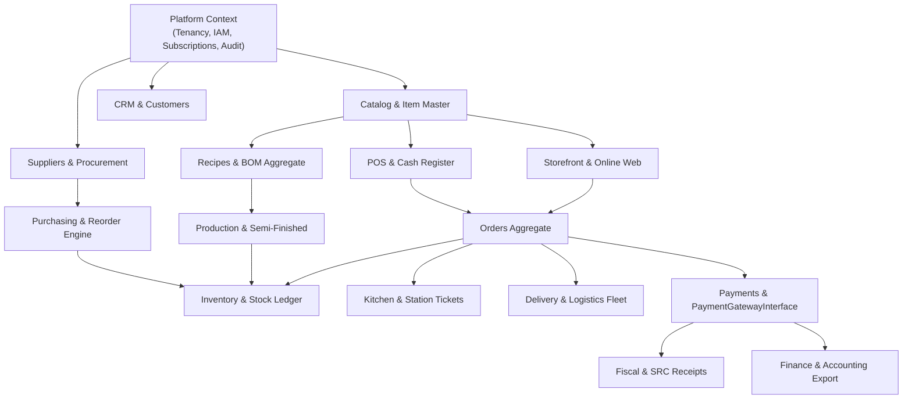

# ERPlannet — Master Architecture & Domain-Driven Design Blueprint

> **System Paradigm**: Multi-Tenant Modular Monolith + Domain-Driven Design (DDD) + Event-Driven Architecture  
> **Core Stack**: Laravel + PostgreSQL (Shared Database, Shared Schema + Row-Level Tenant Isolation) + Redis  

---

## 1. Executive Architectural Vision

ERPlannet is architected as a **Modular Monolith** organized into cohesive **Bounded Contexts** using Domain-Driven Design (DDD). We deliberately choose this architecture over distributed microservices to eliminate unnecessary network latency, distributed transaction complexities (2PC / Saga), and operational DevOps overhead, while preserving strict domain boundaries and modular encapsulation.

```
┌───────────────────────────────────────────────────────────────────────────────────────────────┐
│                                    SaaS ERP Platform Core                                     │
├──────────────────────────────────────────────┬────────────────────────────────────────────────┤
│          Backoffice & Admin (ERP)            │               Storefront & POS                 │
├──────────────────────────────────────────────┼────────────────────────────────────────────────┤
│ • Dashboard & Analytics                      │ • POS Terminal (Online / Offline PWA)          │
│ • Catalog & Item Master (7 Types)            │ • Kitchen Display System (KDS)                 │
│ • Inventory & Immutable Stock Ledger         │ • Public Web Ordering & Cart                   │
│ • Recipes & Multi-Level BOM Production       │ • Checkout & Payment Gateways                  │
│ • Procurement & Automated Reorder Engine     │ • Order Tracking & Real-time Delivery Status   │
│ • Delivery Fleet & Driver Logistics          │                                                │
│ • Finance, Fiscal Receipts & Audit Logs      │                                                │
└──────────────────────────────────────────────┴────────────────────────────────────────────────┘
```

---

## 2. Multi-Tenancy Architecture

### Strategy: Shared Database / Shared Schema + `tenant_id`
* All business entities are strictly partitioned by `tenant_id` (UUID).
* Secondary scoping by organizational hierarchies:
  * `branch_id` (Физические филиалы / Մասնաճյուղեր)
  * `warehouse_id` (Պահեստներ / Склады)
  * `pos_terminal_id` (Դրամարկղային տերմինալներ)
* **Row-Level Tenant Isolation**:
  * Enforced via Laravel's `BelongsToTenant` trait and Eloquent `TenantScope`.
  * Dynamic tenant resolution via `TenantResolver` using Custom Domain, Subdomain, or `X-Tenant-Slug` HTTP header.
  * Superadmin operations explicitly bypass tenant scoping via `withoutGlobalScopes()`.
* **Enterprise Roadmap**:
  * Shared schema by default for Starter & Professional tiers.
  * Architectural readiness for isolated PostgreSQL databases for Enterprise clients in future phases.

---

## 3. Bounded Context Map



---

## 4. Module & Directory Structure

```
app/
├── Domain/                         # Pure business logic, models, aggregates, domain events
│   ├── Platform/                   # Platform admins, global tenant management
│   ├── Tenant/                     # Tenant, TenantDomain, settings
│   ├── IAM/                        # Users, Roles, Permissions (RBAC)
│   ├── Billing/                    # Plans, Features, Subscriptions, Invoices
│   ├── Branch/                     # Branches, Locations
│   ├── Catalog/                    # Products (7 Item Types), Categories, Units, Barcodes
│   ├── CRM/                        # Customers, Addresses, Loyalty
│   ├── Procurement/                # Suppliers, Purchase Orders, Goods Receipts, Reorder Engine
│   ├── Warehouse/                  # Warehouses, StockLevels, StockMovements (Ledger), Lots/Batches
│   ├── Manufacturing/              # Recipes (Versions), BOM Items, Production Orders
│   ├── POS/                        # Terminals, Sessions, Cash Movements, Z-Reports, Refunds
│   ├── Sales/                      # Orders, OrderItems, OrderStatusHistory
│   ├── Delivery/                   # Drivers, Shifts, Routes, Shipments, COD Settlements
│   ├── Payments/                   # Transactions, Gateways (Ameria, Idram, Telcell, Stripe, Cash)
│   ├── Fiscal/                     # SRC Tax Receipts, CRN devices, QR payloads
│   ├── Audit/                      # System audit logs
│   └── Integration/                # Webhooks, Inbound API sync
│
├── Application/                    # Use Cases, DTOs, Commands, Event Listeners
├── Infrastructure/                 # External service implementations, Gateways, Resolvers
└── Http/                           # Controllers, Middleware, Requests, Resources
```

---

## 5. Universal Item / Product Master Architecture

Instead of segregating items into disjointed databases, ERPlannet utilizes a unified **Item Master** with an explicit type taxonomy:

| Item Type | Constant | Description | Example |
| :--- | :--- | :--- | :--- |
| **RAW_MATERIAL** | `raw_material` | Pure raw materials purchased from suppliers | Ալյուր (Flour), Տավարի միս (Beef) |
| **INGREDIENT** | `ingredient` | Processing ingredients & spices | Աղ (Salt), Պղպեղ (Pepper), Սոխ (Onion) |
| **SEMI_FINISHED** | `semi_finished` | Intermediate goods manufactured in-house | Խմոր (Dough), Մսային միջուկ (Meat filling) |
| **FINISHED_PRODUCT**| `finished_product`| Final product ready for consumer sale | Պելմենի (Pelmeni), Տավարի Քյուֆթա |
| **PACKAGING** | `packaging` | Packaging materials consumed during packing | Տուփ (Box), Թաղանթ (Film), Տոպրակ (Bag) |
| **SERVICE** | `service` | Non-inventory service charge | Առաքման ծառայություն (Delivery fee) |
| **MODIFIER** | `modifier` | Modifiers & add-ons for POS orders | Լրացուցիչ թթվասեր (Extra sour cream) |

### Reverse Lookup (`Product <-> Ingredient`)
Any item can query all recipes where it is consumed:
```php
$recipes = $item->recipesWhereUsed()->with('recipe.product')->get();
```

---

## 6. Recipe & Recursive Bill of Materials (BOM)

### Multi-Version Recipe Aggregate
* **Recipe Entity**:
  * `code`: Unique recipe code (e.g., `RCP-PELMENI-V3`)
  * `version`: Version string (`1.0`, `2.0`, `3.0`) ensuring historical traceability
  * `yield_quantity` & `yield_unit_id`: Batch output quantity
  * `scrap_percentage`: Expected baseline loss during preparation
  * `labor_cost` & `overhead_cost`: Operational cost allocations
* **Components (`recipe_items`)**:
  * References component item (raw material, ingredient, or **semi-finished item**)
  * `waste_percentage`: Component-specific cleaning/cooking loss

### Recursive Semi-Finished Production Flow
```
Raw Ingredients (Flour, Water, Salt) ──► Semi-Finished (Dough) ──┐
                                                                 ├──► Finished Product (Pelmeni)
Raw Ingredients (Beef, Onion, Spices) ─► Semi-Finished (Filling) ┘
```

---

## 7. Warehouse & Immutable Stock Ledger

### Strict Rule: Never Mutate Stock Directly
All inventory changes are recorded in an **Immutable Double-Entry Ledger** (`stock_movements`):
* `type`: `purchase_receipt`, `sale_delivery`, `production_consume`, `production_yield`, `transfer_out`, `transfer_in`, `scrap`, `adjustment_plus`, `adjustment_minus`
* `quantity`, `unit_cost`, `balance_before`, `balance_after`
* `reference_type` and `reference_id` (e.g. `PurchaseOrder`, `Order`, `ProductionOrder`)

### Moving Weighted Average (MWA) Costing
When receiving purchases at varying prices:
$$\text{New Average Cost} = \frac{(\text{Current Qty} \times \text{Current Cost}) + (\text{Received Qty} \times \text{Purchase Price})}{\text{Current Qty} + \text{Received Qty}}$$
Subsequent recipe production and sales consume inventory at this time-aware average cost.

---

## 8. Lots, Batches & Expiration (FEFO)

* **`stock_batches` Entity**:
  * `batch_number`, `mfg_date`, `expiry_date`, `status` (`active`, `quarantine`, `expired`, `exhausted`)
  * `cost_price`: Specific batch acquisition cost
* **FEFO Dispatching (First Expired, First Out)**:
  * When picking stock for POS sales or production orders, the system automatically allocates batches with the nearest expiration date.

---

## 9. Waste Subsystem

Dedicated scrap classification with mandatory reasoning:
* **Expired**: Ժամկետանց ապրանք
* **Spoilage**: Փչացում / Խոտան
* **Production Loss**: Արտադրական կորուստ
* **Kitchen Waste**: Խոհանոցային մնացորդներ
* **Damaged**: Վնասված տարա կամ փաթեթավորում
* **Unknown Loss**: Գույքագրման պակասորդ

---

## 10. Stock Reservation Model

Inventory balances maintain a strict 3-state lifecycle:
$$\text{Quantity Available} = \text{Quantity On Hand} - \text{Quantity Reserved}$$
1. **Available**: Stock free to be sold or allocated.
2. **Reserved**: Stock committed to an online order or scheduled production batch.
3. **Consumed**: Stock deducted via immutable stock movement upon order dispatch/completion.
4. **Released**: Stock reservation returned to available balance upon order cancellation.

---

## 11. Purchasing & Automated Reorder Engine

### Purchasing Workflow
$$\text{Supplier} \longrightarrow \text{Purchase Order} \longrightarrow \text{Supplier Invoice} \longrightarrow \text{Goods Receipt} \longrightarrow \text{Stock Movement}$$
* **Invoice $\neq$ Stock**: An invoice may be registered for accounting before the physical goods receipt is verified at the warehouse loading dock.

### Reorder Engine
$$\text{If } \text{Stock Level} \le \text{Reorder Point} \implies \text{Generate Purchase Suggestion} = (\text{Target Stock} - \text{Current Stock})$$
* Calculates suggested supplier, last purchase price, and average consumption rate.

---

## 12. POS Architecture & Offline Sync

```
POS Terminal (Local UI) ──► Local IndexedDB Queue ──► Sync Engine ──► Laravel API (Idempotency Key) ──► PostgreSQL
                                  │
                          LOCAL_PENDING
                                  │
                               SYNCING
                                  │
                                SYNCED
```
* **Offline Resiliency**: In the event of network disruption, POS terminals store tickets locally in IndexedDB.
* **Synchronization**: On reconnection, transactions are sent in order with idempotency keys to avoid double-charging.
* **Consumption Flow**: POS Order $\to$ Payment $\to$ Kitchen Station $\to$ Fulfillment $\to$ Recipe BOM Inventory Deduction.

---

## 13. Payments & Fiscal Compliance

### Provider-Agnostic Interface
```php
interface PaymentGatewayInterface {
    public function initiatePayment(PaymentTransaction $transaction, array $params = []): array;
    public function verifyPayment(PaymentTransaction $transaction, array $payload = []): array;
    public function refund(PaymentTransaction $transaction, float $amount, string $reason = ''): array;
}
```
* Built-in adapters: **Cash**, **Bank Transfer**, **Ameria Bank (vPOS)**, **Idram**, **Telcell**, **ArCa**, **Stripe**.

### Armenian SRC Fiscal Integration (ՀԴՄ)
* Decoupled from internal point-of-sale receipts.
* Generates fiscal registration numbers, Cash Register Numbers (CRN), tax code mapping, and SRC QR verification payloads.

---

## 14. Delivery & Logistics Context

* **Delivery Shipment**: Tracking status (`pending`, `assigned`, `dispatched`, `in_transit`, `delivered`, `failed`, `returned`).
* **Fleet Management**: Delivery drivers, shifts, vehicle odometer tracking, and delivery routes with ordered stops.
* **COD Settlement Lifecycle**: Strict custody handoff from courier to company cashier (`expected` $\to$ `collected` $\to$ `courier_holding` $\to$ `submitted` $\to$ `verified` $\to$ `settled`).
