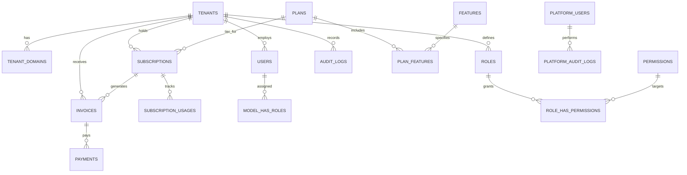
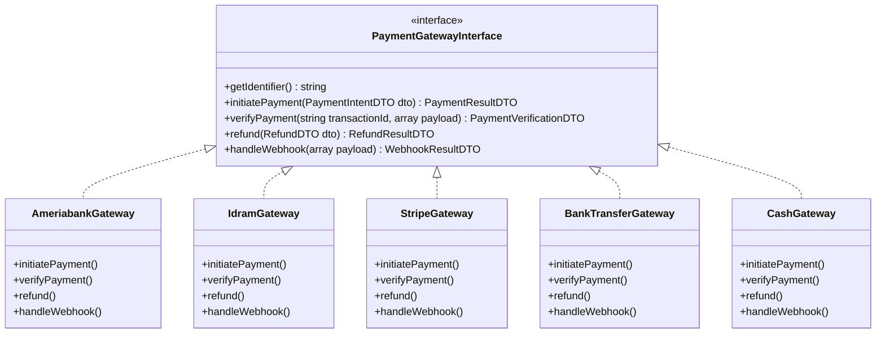

# PHASE 0 — SaaS Foundation: Technical Architecture Blueprint

**Project Working Name:** `ERPlannet` (SaaS ERP / CRM Platform)  
**Target Environment:** Shared Database + Shared Schema with Row-Level Isolation (with Schema-per-Tenant migration readiness)  
**Tech Stack:** Laravel 13, PHP 8.4+, PostgreSQL 17, Redis 7, Vue 3, TypeScript, Tailwind CSS, Vite, Docker Compose, Nginx, Cloudflare.

---

## 1. High-Level System Architecture

The platform is designed as an **API-First, Multi-Tenant SaaS Engine**. The core backend is entirely decoupled from client presentations, serving Web SPAs, progressive web apps (PWAs), future mobile applications (iOS/Android), and external webhooks through unified, versioned APIs.

```
                                  [ Cloudflare CDN & WAF ]
                  +--------------------------+--------------------------+
                  | (Custom Domain SSL)      | (*.platform.com SSL)     |
                  v                          v                          v
          [ app.tenant.am ]        [ company.platform.com ]    [ platform.com / API ]
                  +--------------------------+--------------------------+
                                             |
                                   [ Nginx Reverse Proxy ]
                                             |
                         +-------------------+-------------------+
                         |                                       |
                [ Laravel 13 API (PHP 8.4) ]             [ Static Assets / Vite ]
                (Tenant Context Pipeline)
                         |
       +-----------------+-----------------+-----------------+
       |                 |                 |                 |
 [ PostgreSQL 17 ]   [ Redis 7 ]    [ S3 / MinIO ]   [ External Gateways ]
  - Shared DB         - Cache        - Documents       - Ameriabank vPOS
  - Tenant Scopes     - Queue        - Logos           - Idram
  - Row Security      - Rate Limits  - Invoices        - Stripe
                      - Locks                          - WooCommerce API
```

### Component Responsibilities

1. **Edge Layer (Cloudflare + Nginx):**
   - SSL termination (including Cloudflare SSL for SaaS for tenant custom domains).
   - DDoS protection, Web Application Firewall (WAF), HTTP/2 and HTTP/3 support.
   - Nginx forwards original host header (`Host: $host`), client IP (`X-Forwarded-For`), and protocol to Laravel.

2. **Application Layer (Laravel 13 on PHP 8.4):**
   - Stateless REST API (`/api/v1/...`).
   - Domain-Driven Modular architecture (`Domain/Tenant`, `Domain/Platform`, `Domain/Billing`, etc.).
   - Multi-tenant pipeline: Automatically detects tenant, activates `TenantContext`, binds global query scopes, configures tenant-specific settings (timezone, currency, locale).

3. **Background Worker Layer (Laravel Queue with Redis):**
   - Asynchronous processing for heavy tasks: billing cycles, invoice generation, webhooks, notifications (SMS/Email), external integrations (WooCommerce sync).
   - Jobs are **Tenant-Aware**: Tenant context is automatically captured when dispatched and rehydrated upon execution.

4. **Storage Layer:**
   - PostgreSQL 17 with UUIDv7 primary keys for time-ordered index efficiency.
   - S3-compatible Object Storage (Local MinIO in development, AWS S3 / Cloudflare R2 in production) with path isolation: `/{tenant_uuid}/...`.

---

## 2. Multi-Tenancy & Tenant Isolation Strategy

### 2.1 Multi-Tenancy Model: Phase 0 vs Phase X
- **Phase 0 to 1,000+ Tenants:** **Shared Database, Shared Schema** with `tenant_id` foreign keys and composite indexing.
  - *Reasoning:* Extreme operational simplicity, single migration runs for all tenants, lowest resource footprint on PostgreSQL connections and memory.
- **Enterprise / Scalability Path (Phase X):**
  - Architecture relies on a `TenantConnectionResolver` and `TenantManager` abstraction. Moving high-volume enterprise tenants to a dedicated schema (`SET search_path TO tenant_123`) or a dedicated database connection (`DB::connection('tenant_123')`) requires **zero changes to business logic models or controllers**.

### 2.2 The 6-Layer Defense-in-Depth Isolation

```
[ Incoming HTTP Request ]
       |
  (Layer 1) ---> [ IdentifyTenantMiddleware ]: Extracts domain/subdomain/header -> Resolves Tenant
       |
  (Layer 2) ---> [ TenantContext Singleton ]: Stores current tenant, timezone, locale in app container
       |
  (Layer 3) ---> [ Route Scoping & Model Binding ]: Auto-verifies model route bindings belong to current tenant
       |
  (Layer 4) ---> [ Eloquent Global Scope (TenantScope) ]: Auto-appends `WHERE tenant_id = ?` to all tenant models
       |
  (Layer 5) ---> [ Model Observer / Saving Hook ]: Automatically injects `tenant_id` on new records
       |
  (Layer 6) ---> [ Database Constraints ]: Composite unique keys (e.g. `UNIQUE(tenant_id, sku)`) and Foreign Keys
```

#### Layer 1: Middleware Resolution
`IdentifyTenantMiddleware` extracts the tenant by:
1. Custom Domain (`app.company.am` -> lookup in `tenant_domains`).
2. Subdomain (`company.platform.com` -> lookup in `tenants.subdomain`).
3. Fallback header (`X-Tenant-ID` or `X-Tenant-Slug` for testing or native mobile apps when domain routing is behind a single API endpoint).
If the tenant is inactive, suspended, or missing, the request terminates immediately with an HTTP 404 or 403 (with standard error JSON).

#### Layer 2 & 3: Context & Scoped Bindings
Once verified, the tenant is registered in `TenantContext::class`. All routes utilize scoped bindings:
```php
Route::middleware(['tenant.identify', 'auth:sanctum', 'tenant.verify'])->group(function () {
    Route::apiResource('customers', CustomerController::class)->scoped();
});
```

#### Layer 4 & 5: Eloquent `BelongsToTenant` Trait
Every tenant-scoped model uses a single unified trait:
```php
namespace App\Infrastructure\MultiTenancy\Traits;

use App\Infrastructure\MultiTenancy\Scopes\TenantScope;
use App\Infrastructure\MultiTenancy\TenantContext;
use Illuminate\Database\Eloquent\Relations\BelongsTo;
use App\Domain\Tenant\Models\Tenant;

trait BelongsToTenant
{
    public static function bootBelongsToTenant(): void
    {
        static::addGlobalScope(new TenantScope());

        static::creating(function ($model) {
            if (empty($model->tenant_id)) {
                $model->tenant_id = app(TenantContext::class)->id();
            }
        });
    }

    public function tenant(): BelongsTo
    {
        return $this->belongsTo(Tenant::class, 'tenant_id');
    }
}
```

The `TenantScope`:
```php
namespace App\Infrastructure\MultiTenancy\Scopes;

use App\Infrastructure\MultiTenancy\TenantContext;
use Illuminate\Database\Eloquent\Builder;
use Illuminate\Database\Eloquent\Model;
use Illuminate\Database\Eloquent\Scope;

class TenantScope implements Scope
{
    public function apply(Builder $builder, Model $model): void
    {
        $context = app(TenantContext::class);
        if ($context->hasTenant()) {
            $builder->where($model->getTable() . '.tenant_id', '=', $context->id());
        }
    }
}
```

#### Layer 6: PostgreSQL Composite Constraints
No tenant model has standalone unique constraints on business attributes (like `code`, `slug`, `sku`, `phone`, `email`). All unique indexes are compound:
```sql
CREATE UNIQUE INDEX idx_products_tenant_sku ON products (tenant_id, sku);
CREATE UNIQUE INDEX idx_customers_tenant_phone ON customers (tenant_id, phone);
CREATE UNIQUE INDEX idx_branches_tenant_code ON branches (tenant_id, code);
```

---

## 3. Platform vs Tenant Architecture

A strict security boundary separates the **Platform Level** (Platform Owner / Superadmins) and the **Tenant Level** (SaaS Customers).

| Dimension | Platform Level (System Management) | Tenant Level (Business Operations) |
| :--- | :--- | :--- |
| **Users** | `platform_users` (Superadmin, Billing, Tech Support) | `users` (Tenant Owner, Manager, Courier, Cashier) |
| **Auth Guard** | `platform` (Separate login endpoint & separate tokens) | `tenant` (Sanctum with tenant-scoped credentials) |
| **Access URL** | `admin.platform.com` or `/api/v1/platform/...` | `company.platform.com` or `app.company.am` |
| **Scope of Data** | Global across all tenants, plans, billing, health | Strictly scoped to their own `tenant_id` |
| **Capabilities** | Manage plans, suspend tenants, impersonate (audited) | Manage catalog, inventory, sales, users, branches |

> [!IMPORTANT]
> **No Shared Authentication:** A platform administrator cannot login via tenant authentication forms. Tenant users cannot access `/api/v1/platform/`. If platform tech support needs to troubleshoot a tenant, they must use an **Audited Impersonation Token** with expiration and strict audit logs recorded on both platform and tenant audit trails.

---

## 4. Core Database Schema & ERD (Phase 0)

All primary keys use **UUIDv7** (time-ordered 128-bit identifiers) providing optimal B-tree index clustering, native UUID storage in PostgreSQL (`uuid`), and avoiding sequential ID enumeration vulnerabilities.



### 4.1 Platform & Tenant Core Tables

#### `tenants`
```sql
CREATE TABLE tenants (
    id UUID PRIMARY KEY,
    name VARCHAR(255) NOT NULL,
    legal_name VARCHAR(255) NULL,
    tax_number VARCHAR(100) NULL,             -- HVHH (Armenia), Tax ID
    slug VARCHAR(100) NOT NULL UNIQUE,         -- internal identifier
    subdomain VARCHAR(100) NOT NULL UNIQUE,    -- company.platform.com
    custom_domain VARCHAR(255) NULL UNIQUE,   -- app.company.com
    status VARCHAR(50) NOT NULL DEFAULT 'trialing', -- trialing, active, past_due, suspended, canceled
    country VARCHAR(2) NOT NULL DEFAULT 'AM',  -- ISO 3166-1 alpha-2
    currency VARCHAR(3) NOT NULL DEFAULT 'AMD',-- ISO 4217
    timezone VARCHAR(100) NOT NULL DEFAULT 'Asia/Yerevan',
    default_locale VARCHAR(10) NOT NULL DEFAULT 'hy', -- hy, ru, en
    settings JSONB NOT NULL DEFAULT '{}'::jsonb,
    trial_ends_at TIMESTAMPTZ NULL,
    suspended_at TIMESTAMPTZ NULL,
    suspended_reason TEXT NULL,
    created_at TIMESTAMPTZ NOT NULL DEFAULT NOW(),
    updated_at TIMESTAMPTZ NOT NULL DEFAULT NOW(),
    deleted_at TIMESTAMPTZ NULL
);
CREATE INDEX idx_tenants_status ON tenants(status);
```

#### `tenant_domains`
```sql
CREATE TABLE tenant_domains (
    id UUID PRIMARY KEY,
    tenant_id UUID NOT NULL REFERENCES tenants(id) ON DELETE CASCADE,
    domain VARCHAR(255) NOT NULL UNIQUE,
    is_primary BOOLEAN NOT NULL DEFAULT FALSE,
    is_verified BOOLEAN NOT NULL DEFAULT FALSE,
    verification_token VARCHAR(100) NULL,
    ssl_status VARCHAR(50) NOT NULL DEFAULT 'pending', -- pending, active, failed
    created_at TIMESTAMPTZ NOT NULL DEFAULT NOW(),
    updated_at TIMESTAMPTZ NOT NULL DEFAULT NOW()
);
CREATE INDEX idx_tenant_domains_lookup ON tenant_domains(domain, is_verified);
```

#### `platform_users`
```sql
CREATE TABLE platform_users (
    id UUID PRIMARY KEY,
    name VARCHAR(255) NOT NULL,
    email VARCHAR(255) NOT NULL UNIQUE,
    password VARCHAR(255) NOT NULL,            -- Argon2id
    role VARCHAR(50) NOT NULL DEFAULT 'admin', -- superadmin, support, billing
    is_active BOOLEAN NOT NULL DEFAULT TRUE,
    two_factor_secret TEXT NULL,
    two_factor_recovery_codes JSONB NULL,
    two_factor_confirmed_at TIMESTAMPTZ NULL,
    remember_token VARCHAR(100) NULL,
    created_at TIMESTAMPTZ NOT NULL DEFAULT NOW(),
    updated_at TIMESTAMPTZ NOT NULL DEFAULT NOW()
);
```

#### `users` (Tenant User)
```sql
CREATE TABLE users (
    id UUID PRIMARY KEY,
    tenant_id UUID NOT NULL REFERENCES tenants(id) ON DELETE CASCADE,
    name VARCHAR(255) NOT NULL,
    email VARCHAR(255) NOT NULL,
    phone VARCHAR(50) NULL,
    password VARCHAR(255) NOT NULL,            -- Argon2id
    is_active BOOLEAN NOT NULL DEFAULT TRUE,
    is_owner BOOLEAN NOT NULL DEFAULT FALSE,   -- Tenant primary account holder
    email_verified_at TIMESTAMPTZ NULL,
    phone_verified_at TIMESTAMPTZ NULL,
    two_factor_secret TEXT NULL,
    two_factor_recovery_codes JSONB NULL,
    two_factor_confirmed_at TIMESTAMPTZ NULL,
    locale VARCHAR(10) NOT NULL DEFAULT 'hy',
    settings JSONB NOT NULL DEFAULT '{}'::jsonb,
    created_at TIMESTAMPTZ NOT NULL DEFAULT NOW(),
    updated_at TIMESTAMPTZ NOT NULL DEFAULT NOW(),
    deleted_at TIMESTAMPTZ NULL,
    CONSTRAINT uq_tenant_user_email UNIQUE (tenant_id, email)
);
CREATE INDEX idx_users_tenant_active ON users(tenant_id, is_active);
```

### 4.2 RBAC Tables (Tenant-Aware Role & Permission System)

```sql
CREATE TABLE permissions (
    id UUID PRIMARY KEY,
    code VARCHAR(100) NOT NULL UNIQUE,         -- e.g., 'crm.customers.create', 'sales.orders.view'
    module VARCHAR(50) NOT NULL,               -- 'crm', 'sales', 'warehouse', 'production'
    name VARCHAR(255) NOT NULL,
    description TEXT NULL,
    created_at TIMESTAMPTZ NOT NULL DEFAULT NOW()
);

CREATE TABLE roles (
    id UUID PRIMARY KEY,
    tenant_id UUID NOT NULL REFERENCES tenants(id) ON DELETE CASCADE,
    name VARCHAR(100) NOT NULL,
    slug VARCHAR(100) NOT NULL,
    description TEXT NULL,
    is_system BOOLEAN NOT NULL DEFAULT FALSE,  -- Owner, Admin (cannot be deleted)
    created_at TIMESTAMPTZ NOT NULL DEFAULT NOW(),
    updated_at TIMESTAMPTZ NOT NULL DEFAULT NOW(),
    CONSTRAINT uq_roles_tenant_slug UNIQUE (tenant_id, slug)
);

CREATE TABLE role_has_permissions (
    role_id UUID NOT NULL REFERENCES roles(id) ON DELETE CASCADE,
    permission_id UUID NOT NULL REFERENCES permissions(id) ON DELETE CASCADE,
    PRIMARY KEY (role_id, permission_id)
);

CREATE TABLE model_has_roles (
    role_id UUID NOT NULL REFERENCES roles(id) ON DELETE CASCADE,
    model_type VARCHAR(255) NOT NULL,
    model_id UUID NOT NULL,
    tenant_id UUID NOT NULL REFERENCES tenants(id) ON DELETE CASCADE,
    PRIMARY KEY (role_id, model_id, model_type)
);
CREATE INDEX idx_model_has_roles_lookup ON model_has_roles(tenant_id, model_id);
```

### 4.3 SaaS Plans, Features & Subscriptions Tables

#### `plans`
```sql
CREATE TABLE plans (
    id UUID PRIMARY KEY,
    code VARCHAR(100) NOT NULL UNIQUE,         -- 'starter', 'professional', 'enterprise'
    name VARCHAR(255) NOT NULL,
    description TEXT NULL,
    is_active BOOLEAN NOT NULL DEFAULT TRUE,
    price_monthly NUMERIC(15, 2) NOT NULL DEFAULT 0.00,
    price_yearly NUMERIC(15, 2) NOT NULL DEFAULT 0.00,
    currency VARCHAR(3) NOT NULL DEFAULT 'AMD',
    trial_days INT NOT NULL DEFAULT 14,
    sort_order INT NOT NULL DEFAULT 0,
    metadata JSONB NOT NULL DEFAULT '{}'::jsonb,
    created_at TIMESTAMPTZ NOT NULL DEFAULT NOW(),
    updated_at TIMESTAMPTZ NOT NULL DEFAULT NOW()
);
```

#### `features` & `plan_features`
```sql
CREATE TABLE features (
    id UUID PRIMARY KEY,
    code VARCHAR(100) NOT NULL UNIQUE,         -- 'feature.crm', 'limit.users', 'limit.branches', 'limit.orders_monthly'
    name VARCHAR(255) NOT NULL,
    type VARCHAR(50) NOT NULL DEFAULT 'boolean',-- 'boolean', 'limit'
    module VARCHAR(50) NOT NULL,
    description TEXT NULL,
    created_at TIMESTAMPTZ NOT NULL DEFAULT NOW()
);

CREATE TABLE plan_features (
    id UUID PRIMARY KEY,
    plan_id UUID NOT NULL REFERENCES plans(id) ON DELETE CASCADE,
    feature_id UUID NOT NULL REFERENCES features(id) ON DELETE CASCADE,
    value VARCHAR(255) NOT NULL,               -- 'true', '5', '1000', 'unlimited'
    created_at TIMESTAMPTZ NOT NULL DEFAULT NOW(),
    updated_at TIMESTAMPTZ NOT NULL DEFAULT NOW(),
    CONSTRAINT uq_plan_feature UNIQUE (plan_id, feature_id)
);
```

#### `subscriptions` & `subscription_usages`
```sql
CREATE TABLE subscriptions (
    id UUID PRIMARY KEY,
    tenant_id UUID NOT NULL REFERENCES tenants(id) ON DELETE CASCADE,
    plan_id UUID NOT NULL REFERENCES plans(id) ON DELETE RESTRICT,
    status VARCHAR(50) NOT NULL,               -- 'trialing', 'active', 'past_due', 'canceled', 'grace_period'
    billing_cycle VARCHAR(20) NOT NULL DEFAULT 'monthly', -- 'monthly', 'yearly'
    starts_at TIMESTAMPTZ NOT NULL,
    ends_at TIMESTAMPTZ NOT NULL,
    trial_ends_at TIMESTAMPTZ NULL,
    canceled_at TIMESTAMPTZ NULL,
    grace_period_ends_at TIMESTAMPTZ NULL,
    auto_renew BOOLEAN NOT NULL DEFAULT TRUE,
    metadata JSONB NOT NULL DEFAULT '{}'::jsonb,
    created_at TIMESTAMPTZ NOT NULL DEFAULT NOW(),
    updated_at TIMESTAMPTZ NOT NULL DEFAULT NOW()
);
CREATE INDEX idx_subscriptions_tenant_status ON subscriptions(tenant_id, status);

CREATE TABLE subscription_usages (
    id UUID PRIMARY KEY,
    subscription_id UUID NOT NULL REFERENCES subscriptions(id) ON DELETE CASCADE,
    feature_code VARCHAR(100) NOT NULL,
    used_count BIGINT NOT NULL DEFAULT 0,
    reset_at TIMESTAMPTZ NULL,
    created_at TIMESTAMPTZ NOT NULL DEFAULT NOW(),
    updated_at TIMESTAMPTZ NOT NULL DEFAULT NOW(),
    CONSTRAINT uq_sub_feature_usage UNIQUE (subscription_id, feature_code)
);
```

### 4.4 Invoicing & Payments Tables

#### `invoices`
```sql
CREATE TABLE invoices (
    id UUID PRIMARY KEY,
    tenant_id UUID NOT NULL REFERENCES tenants(id) ON DELETE CASCADE,
    subscription_id UUID NULL REFERENCES subscriptions(id) ON DELETE SET NULL,
    invoice_number VARCHAR(100) NOT NULL UNIQUE, -- e.g., 'INV-2026-000001'
    status VARCHAR(50) NOT NULL DEFAULT 'open',   -- 'draft', 'open', 'paid', 'void', 'uncollectible'
    currency VARCHAR(3) NOT NULL DEFAULT 'AMD',
    subtotal NUMERIC(15, 2) NOT NULL DEFAULT 0.00,
    tax NUMERIC(15, 2) NOT NULL DEFAULT 0.00,
    total NUMERIC(15, 2) NOT NULL DEFAULT 0.00,
    due_date DATE NOT NULL,
    paid_at TIMESTAMPTZ NULL,
    billing_details JSONB NOT NULL DEFAULT '{}'::jsonb,
    pdf_path VARCHAR(500) NULL,
    created_at TIMESTAMPTZ NOT NULL DEFAULT NOW(),
    updated_at TIMESTAMPTZ NOT NULL DEFAULT NOW()
);
CREATE INDEX idx_invoices_tenant_status ON invoices(tenant_id, status);
```

#### `payments`
```sql
CREATE TABLE payments (
    id UUID PRIMARY KEY,
    tenant_id UUID NOT NULL REFERENCES tenants(id) ON DELETE CASCADE,
    invoice_id UUID NULL REFERENCES invoices(id) ON DELETE SET NULL,
    gateway VARCHAR(50) NOT NULL,               -- 'ameriabank', 'idram', 'stripe', 'bank_transfer', 'cash'
    transaction_id VARCHAR(255) NULL,           -- external gateway ID
    amount NUMERIC(15, 2) NOT NULL,
    currency VARCHAR(3) NOT NULL DEFAULT 'AMD',
    status VARCHAR(50) NOT NULL DEFAULT 'pending',-- 'pending', 'successful', 'failed', 'refunded'
    gateway_response JSONB NOT NULL DEFAULT '{}'::jsonb,
    payment_method_details JSONB NOT NULL DEFAULT '{}'::jsonb,
    paid_at TIMESTAMPTZ NULL,
    refunded_at TIMESTAMPTZ NULL,
    created_at TIMESTAMPTZ NOT NULL DEFAULT NOW(),
    updated_at TIMESTAMPTZ NOT NULL DEFAULT NOW()
);
CREATE INDEX idx_payments_tenant_gateway ON payments(tenant_id, gateway, status);
CREATE INDEX idx_payments_tx_id ON payments(gateway, transaction_id);
```

### 4.5 Centralized Audit Logging

#### `audit_logs`
```sql
CREATE TABLE audit_logs (
    id UUID PRIMARY KEY,
    tenant_id UUID NOT NULL REFERENCES tenants(id) ON DELETE CASCADE,
    user_id UUID NULL REFERENCES users(id) ON DELETE SET NULL,
    action VARCHAR(100) NOT NULL,              -- 'create', 'update', 'delete', 'login', 'impersonate'
    entity_type VARCHAR(100) NOT NULL,         -- 'Order', 'Product', 'User', etc.
    entity_id UUID NOT NULL,
    old_values JSONB NULL,
    new_values JSONB NULL,
    ip_address INET NULL,
    user_agent TEXT NULL,
    created_at TIMESTAMPTZ NOT NULL DEFAULT NOW()
);
CREATE INDEX idx_audit_logs_tenant_entity ON audit_logs(tenant_id, entity_type, entity_id);
CREATE INDEX idx_audit_logs_tenant_created ON audit_logs(tenant_id, created_at DESC);
```

---

## 5. Subscription, Billing & Entitlement Engine

No feature access or quota check is ever hardcoded into controllers. Access is managed through an **Entitlement Engine**:

```
[ Request: Create Product ]
          |
  [ Check Feature Flag: 'feature.catalog' ] -> Allowed in Plan?
          |
  [ Check Quota Limit: 'limit.products' ] -> Current Count < Limit?
          |
  +---------------+---------------+
  | YES                           | NO
  v                               v
[ Proceed to Action ]      [ Throw PlanLimitExceededException (HTTP 402) ]
                           {
                             "error": "PLAN_LIMIT_REACHED",
                             "message": "Maximum products limit (100) reached for plan 'Starter'",
                             "upgrade_url": "/billing/upgrade"
                           }
```

### 5.1 Entitlement Service Interface
```php
namespace App\Domain\Billing\Contracts;

interface EntitlementManagerInterface
{
    /** Check if boolean feature is enabled for current tenant */
    public function can(string $featureCode): bool;

    /** Get the configured maximum limit for a numeric feature (or INF for unlimited) */
    public function getLimit(string $featureCode): int|float;

    /** Get the current usage count for the given feature */
    public function getUsage(string $featureCode): int;

    /** Verify if tenant can consume $count units without exceeding limit */
    public function canConsume(string $featureCode, int $count = 1): bool;

    /** Consume units and record in subscription_usages */
    public function consume(string $featureCode, int $count = 1): void;

    /** Assert entitlement or throw PlanLimitExceededException */
    public function assertCan(string $featureCode, int $count = 1): void;
}
```

---

## 6. Payment Gateway Abstraction Architecture

Payment processing uses a **Strategy / Factory Pattern**. Business logic (checkout, subscription renewal, invoice settlement) interacts exclusively with `PaymentGatewayInterface`:



### 6.1 DTO Contracts
- **`PaymentIntentDTO`**: `tenant_id`, `invoice_id`, `amount`, `currency`, `return_url`, `cancel_url`, `description`, `customer_metadata`.
- **`PaymentResultDTO`**: `status` (redirect, pending, completed), `redirect_url`, `transaction_id`, `raw_response`.
- **`WebhookResultDTO`**: `verified`, `transaction_id`, `status` (paid, failed, refunded), `amount`, `currency`, `error_message`.

---

## 7. Authentication, RBAC & Security Strategy

### 7.1 Cryptography & Hashing
- **Passwords:** `Argon2id` via PHP `sodium` (Memory: 65536 KB, Time cost: 4, Threads: 2).
- **API Tokens:** Laravel Sanctum using SHA-256 hashed personal access tokens. Each token stores tenant ID and abilities (e.g. `['orders:read', 'orders:create']`).
- **Encrypted Columns:** API keys, payment secrets, and 2FA secrets are encrypted using AES-256-GCM via Laravel's `encrypted` model attribute casting.

### 7.2 Two-Factor Authentication (2FA)
- Time-based One-Time Password (TOTP) compliant with RFC 6238 (Google Authenticator, Apple Passwords).
- 8 single-use cryptographically secure recovery codes generated upon 2FA enablement, stored as hashed tokens in `two_factor_recovery_codes`.

### 7.3 Rate Limiting Strategy (Redis Token Bucket)
- **Public Endpoints (Login/Register/Forgot Password):** 5 requests / minute per IP.
- **Tenant API Standard Endpoints:** 120 requests / minute per user token.
- **Tenant Plan-Level API Limit:** Enforced dynamically per tenant (e.g. Starter: 1,000 req/day; Enterprise: 100,000 req/day).

---

## 8. Internationalization & Localization Architecture

1. **Translations:** Stored in structured JSON files (`lang/hy.json`, `lang/ru.json`, `lang/en.json`) and returned via a lightweight frontend translation API endpoint `/api/v1/translations/{locale}` cached by Cloudflare and client `localStorage`.
2. **Dates & Times:**
   - Database always stores timestamps in **UTC** (`TIMESTAMPTZ`).
   - Server casts dates using tenant's timezone (`tenants.timezone`, default `Asia/Yerevan`).
   - Frontend displays formatted strings using `Intl.DateTimeFormat` with tenant/user locale.
3. **Currencies & Numbers:**
   - Stored in `numeric(15, 2)` or `numeric(15, 4)` for high-precision quantities.
   - Formatted client-side with `Intl.NumberFormat(locale, { style: 'currency', currency })`.

---

## 9. API Design & Standardization

### 9.1 Versioning & Base URLs
- Platform Administration API: `https://api.platform.com/api/v1/platform/...`
- Tenant API: `https://company.platform.com/api/v1/...` or `https://app.company.am/api/v1/...`

### 9.2 Standardized JSON Envelopes

#### Success Envelope:
```json
{
  "success": true,
  "data": {
    "id": "01925b30-e37d-784f-b481-9b168a2bf6cb",
    "name": "Arman Hovhannisyan",
    "email": "arman@example.am"
  },
  "meta": {
    "timestamp": "2026-10-08T12:58:18Z",
    "version": "v1"
  }
}
```

#### Paginated Envelope:
```json
{
  "success": true,
  "data": [ ... ],
  "meta": {
    "pagination": {
      "current_page": 1,
      "per_page": 25,
      "total": 142,
      "last_page": 6
    }
  }
}
```

#### Error Envelope:
```json
{
  "success": false,
  "error": {
    "code": "VALIDATION_FAILED",
    "message": "The given data was invalid.",
    "details": {
      "email": ["The email has already been taken."]
    }
  },
  "meta": {
    "timestamp": "2026-10-08T12:58:18Z"
  }
}
```

---

## 10. Modular Folder Structure

Following a Domain-Driven Modular architecture inside Laravel 13:

```
ERPlannet/
├── app/
│   ├── Domain/
│   │   ├── Platform/             # Superadmin, Plans, Global Management
│   │   │   ├── Models/
│   │   │   ├── Actions/
│   │   │   └── Services/
│   │   ├── Tenant/               # Tenant Entity, Domains, Settings
│   │   │   ├── Models/
│   │   │   ├── Actions/
│   │   │   └── DTOs/
│   │   ├── IAM/                  # Identity & Access Management (Users, Roles, Permissions)
│   │   │   ├── Models/
│   │   │   ├── Actions/
│   │   │   └── Policies/
│   │   ├── Billing/              # Subscriptions, Invoices, Entitlements
│   │   │   ├── Contracts/
│   │   │   ├── Services/
│   │   │   ├── Models/
│   │   │   └── Jobs/
│   │   └── Audit/                # Centralized Audit Trails
│   │       ├── Models/
│   │       ├── Listeners/
│   │       └── Services/
│   ├── Infrastructure/           # Technical Drivers & Cross-Cutting Concerns
│   │   ├── MultiTenancy/
│   │   │   ├── TenantContext.php
│   │   │   ├── Scopes/TenantScope.php
│   │   │   ├── Traits/BelongsToTenant.php
│   │   │   └── Resolvers/DomainTenantResolver.php
│   │   ├── Payments/             # Gateway Implementations
│   │   │   ├── Contracts/PaymentGatewayInterface.php
│   │   │   ├── Gateways/AmeriaBankGateway.php
│   │   │   ├── Gateways/IdramGateway.php
│   │   │   ├── Gateways/StripeGateway.php
│   │   │   ├── Gateways/BankTransferGateway.php
│   │   │   ├── Gateways/CashGateway.php
│   │   │   └── PaymentGatewayManager.php
│   │   ├── Storage/              # S3 / MinIO Tenant Path Storage
│   │   └── Notifications/        # Central localized notification dispatchers
│   └── Http/
│       ├── Middleware/
│       │   ├── IdentifyTenant.php
│       │   ├── VerifyTenantActive.php
│       │   └── CheckFeatureEntitlement.php
│       ├── Controllers/
│       │   └── Api/
│       │       └── V1/
│       │           ├── Platform/  # Platform Admin Controllers
│       │           └── Tenant/    # Tenant Operations Controllers
│       └── Requests/
├── config/
│   ├── multitenancy.php
│   ├── billing.php
│   └── payments.php
├── database/
│   ├── migrations/
│   │   ├── 0001_01_01_000000_create_tenants_table.php
│   │   ├── 0001_01_01_000001_create_tenant_domains_table.php
│   │   ├── 0001_01_01_000002_create_platform_users_table.php
│   │   ├── 0001_01_01_000003_create_tenant_users_table.php
│   │   ├── 0001_01_01_000004_create_rbac_tables.php
│   │   ├── 0001_01_01_000005_create_plans_and_features_tables.php
│   │   ├── 0001_01_01_000006_create_subscriptions_and_invoices_tables.php
│   │   ├── 0001_01_01_000007_create_payments_table.php
│   │   └── 0001_01_01_000008_create_audit_logs_table.php
│   └── seeders/
│       ├── PermissionsSeeder.php
│       ├── DefaultPlansSeeder.php
│       └── PlatformAdminSeeder.php
├── docker/
│   ├── php/Dockerfile
│   ├── nginx/default.conf
│   └── redis/redis.conf
├── docker-compose.yml
└── tests/
    ├── Feature/
    │   ├── MultiTenancy/
    │   │   ├── TenantIsolationTest.php
    │   │   └── DomainResolutionTest.php
    │   ├── Billing/
    │   │   └── EntitlementEnforcementTest.php
    │   └── Auth/
    │       └── AuthenticationTest.php
    └── Unit/
```

---

## 11. Docker & Infrastructure Blueprint

A unified Docker Compose setup providing identical local and production environments:

```yaml
services:
  app:
    build:
      context: .
      dockerfile: docker/php/Dockerfile
    container_name: erplannet_app
    restart: unless-stopped
    working_dir: /var/www/html
    volumes:
      - ./:/var/www/html
    environment:
      - APP_ENV=local
      - DB_CONNECTION=pgsql
      - DB_HOST=db
      - DB_PORT=5432
      - DB_DATABASE=erplannet_db
      - DB_USERNAME=erplannet_user
      - DB_PASSWORD=secret_db_pass
      - REDIS_HOST=redis
    depends_on:
      - db
      - redis

  web:
    image: nginx:1.27-alpine
    container_name: erplannet_web
    restart: unless-stopped
    ports:
      - "80:80"
      - "443:443"
    volumes:
      - ./:/var/www/html
      - ./docker/nginx/default.conf:/etc/nginx/conf.d/default.conf
    depends_on:
      - app

  db:
    image: postgres:17-alpine
    container_name: erplannet_db
    restart: unless-stopped
    environment:
      - POSTGRES_DB=erplannet_db
      - POSTGRES_USER=erplannet_user
      - POSTGRES_PASSWORD=secret_db_pass
    volumes:
      - postgres_data:/var/lib/postgresql/data
    ports:
      - "5432:5432"

  redis:
    image: redis:7-alpine
    container_name: erplannet_redis
    restart: unless-stopped
    command: ["redis-server", "--appendonly", "yes"]
    volumes:
      - redis_data:/data
    ports:
      - "6379:6379"

  queue:
    build:
      context: .
      dockerfile: docker/php/Dockerfile
    container_name: erplannet_queue
    restart: unless-stopped
    command: ["php", "artisan", "queue:work", "--tries=3", "--timeout=90"]
    volumes:
      - ./:/var/www/html
    depends_on:
      - app
      - redis

  scheduler:
    build:
      context: .
      dockerfile: docker/php/Dockerfile
    container_name: erplannet_scheduler
    restart: unless-stopped
    command: ["sh", "-c", "while true; do php artisan schedule:run --verbose --no-interaction; sleep 60; done"]
    volumes:
      - ./:/var/www/html
    depends_on:
      - app

volumes:
  postgres_data:
  redis_data:
```

---

## 12. Testing Strategy & Tenant Isolation Verification

Pest PHP is configured for test-driven development. In addition to standard unit and API tests, Phase 0 includes a specialized **Tenant Isolation Test Suite**:

```php
test('tenant A cannot access tenant B records via API', function () {
    $tenantA = Tenant::factory()->create();
    $tenantB = Tenant::factory()->create();
    
    $userA = User::factory()->forTenant($tenantA)->create();
    $userB = User::factory()->forTenant($tenantB)->create();
    
    $roleA = Role::factory()->forTenant($tenantA)->create(['name' => 'Manager']);
    $roleB = Role::factory()->forTenant($tenantB)->create(['name' => 'Manager']);
    
    // Attempting to query Tenant B's role as User A
    $response = $this->actingAs($userA, 'sanctum')
        ->withHeaders(['Host' => "{$tenantA->subdomain}.platform.test"])
        ->getJson("/api/v1/roles/{$roleB->id}");
        
    $response->assertStatus(404); // Scoped binding treats cross-tenant as non-existent
});

test('eloquent query automatically injects tenant_id and scopes to current tenant', function () {
    $tenant1 = Tenant::factory()->create();
    $tenant2 = Tenant::factory()->create();

    app(TenantContext::class)->setCurrentTenant($tenant1);
    $role1 = Role::create(['name' => 'Accountant', 'slug' => 'accountant']);
    expect($role1->tenant_id)->toBe($tenant1->id);

    app(TenantContext::class)->setCurrentTenant($tenant2);
    $role2 = Role::create(['name' => 'Accountant', 'slug' => 'accountant']);
    expect($role2->tenant_id)->toBe($tenant2->id);

    // Querying under tenant 2 context
    $roles = Role::all();
    expect($roles)->toHaveCount(1)
        ->and($roles->first()->id)->toBe($role2->id);
});

test('plan limit exception is thrown when user limit is exceeded', function () {
    $tenant = Tenant::factory()->withPlan('starter', ['limit.users' => 2])->create();
    app(TenantContext::class)->setCurrentTenant($tenant);
    
    User::factory()->count(2)->create(['tenant_id' => $tenant->id]);
    
    $this->expectException(\App\Domain\Billing\Exceptions\PlanLimitExceededException::class);
    app(\App\Domain\Billing\Contracts\EntitlementManagerInterface::class)->assertCan('limit.users');
});
```

---

## 13. Phase 0 Implementation Plan

1. **Step 1: Containerized Environment Bootstrap**
   - Initialize Git repository, `.gitignore`, and Docker compose with PHP 8.4, PostgreSQL 17, Redis 7, Nginx.
   - Install Laravel 13 skeleton with `composer create-project`.
2. **Step 2: Core Domain Architecture & Migrations**
   - Configure PostgreSQL UUIDv7 generation.
   - Run Core Migrations: `tenants`, `tenant_domains`, `platform_users`, `users`, `roles`, `permissions`, `plans`, `features`, `plan_features`, `subscriptions`, `invoices`, `payments`, `audit_logs`.
3. **Step 3: Multi-Tenancy Core Engine**
   - Implement `TenantContext`, `DomainTenantResolver`, `IdentifyTenantMiddleware`, `TenantScope`, and `BelongsToTenant` trait.
4. **Step 4: IAM, Authentication & Security**
   - Implement Argon2id configuration, Sanctum auth tokens, 2FA, and RBAC policies.
   - Create Seeders for system permissions and platform superadmin.
5. **Step 5: Billing & Entitlement Manager**
   - Implement `EntitlementManager`, plan feature verification, and usage limit tracking.
6. **Step 6: Payment Gateway Abstraction Foundation**
   - Implement `PaymentGatewayInterface`, `PaymentGatewayManager`, and skeleton drivers for Ameriabank, Idram, Stripe, Bank Transfer, and Cash.
7. **Step 7: Automated Test Suite**
   - Run Pest tests covering tenant isolation, cross-tenant data leak prevention, domain routing, and plan limits.
