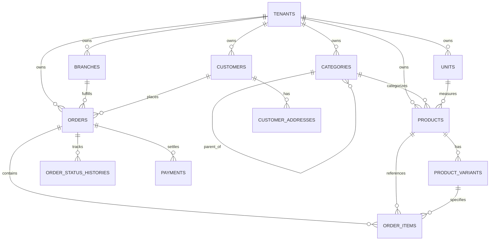
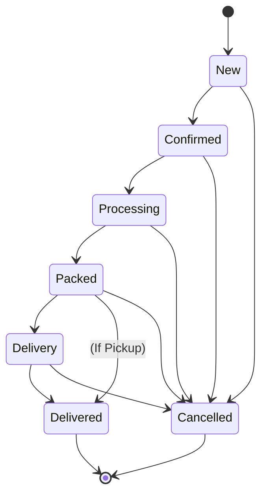

# PHASE 1 — Business Core: Technical Blueprint

**Scope:** Customers (CRM), Catalog (Categories, Products, Units), Branches, Orders (Order Items, Status Workflow, History), and Order Payments.  
**Multi-Tenancy:** Strictly row-level isolated with `tenant_id` on all tables, PostgreSQL composite unique keys, UUIDv7 primary keys, and decimal monetary precision.

---

## 1. Architecture Overview

Phase 1 introduces the operational engine of the SaaS platform. Every entity belongs to the active tenant and interacts seamlessly with the Phase 0 Entitlement Engine (`limit.products`, `limit.branches`, `limit.orders_monthly`).

```
                              [ Tenant Context: tenant_id ]
                                            |
         +------------------+---------------+------------------+
         |                  |                                  |
   [ Branches ]       [ Customers ]                     [ Catalog Engine ]
         |                  |                                  |
         |            - addresses                       - Categories (Tree)
         |            - phones, emails                  - Units (kg, pcs, l)
         |            - customer stats                  - Products (multilingual JSONB)
         |                  |                           - Variants & SKUs
         +------------------+----------------------------------+
                            |
                   [ Orders & Sales Engine ]
                   - Order Numbering Engine (per-tenant sequence)
                   - Order Items (snapshot prices & discounts)
                   - Status State Machine:
                     [New] -> [Confirmed] -> [Processing] -> [Packed] -> [Delivery] -> [Delivered]
                                        \-> [Cancelled]
                   - Immutable Status History Trail
                   - Order Payments (interchangeable gateways)
```

---

## 2. Database Schema & ERD

### 2.1 Entity Relationship Diagram



### 2.2 Core Tables Definition

#### A. Branches
```sql
CREATE TABLE branches (
    id UUID PRIMARY KEY,
    tenant_id UUID NOT NULL REFERENCES tenants(id) ON DELETE CASCADE,
    code VARCHAR(50) NOT NULL,                 -- e.g. 'MAIN', 'YEREVAN_01'
    name VARCHAR(255) NOT NULL,
    address TEXT NULL,
    phone VARCHAR(50) NULL,
    is_main BOOLEAN NOT NULL DEFAULT FALSE,
    is_active BOOLEAN NOT NULL DEFAULT TRUE,
    settings JSONB NOT NULL DEFAULT '{}'::jsonb,
    created_at TIMESTAMPTZ NOT NULL DEFAULT NOW(),
    updated_at TIMESTAMPTZ NOT NULL DEFAULT NOW(),
    deleted_at TIMESTAMPTZ NULL,
    CONSTRAINT uq_branches_tenant_code UNIQUE (tenant_id, code)
);
CREATE INDEX idx_branches_tenant_active ON branches (tenant_id, is_active);
```

#### B. Customers & CRM
```sql
CREATE TABLE customers (
    id UUID PRIMARY KEY,
    tenant_id UUID NOT NULL REFERENCES tenants(id) ON DELETE CASCADE,
    first_name VARCHAR(100) NOT NULL,
    last_name VARCHAR(100) NULL,
    company_name VARCHAR(255) NULL,
    tax_id VARCHAR(100) NULL,                  -- HVHH for B2B customers
    email VARCHAR(255) NULL,
    phone VARCHAR(50) NOT NULL,                -- Primary contact phone
    source VARCHAR(50) NOT NULL DEFAULT 'direct', -- 'direct', 'web', 'phone', 'woocommerce', 'pos'
    tags JSONB NOT NULL DEFAULT '[]'::jsonb,
    notes TEXT NULL,
    total_spent NUMERIC(15, 2) NOT NULL DEFAULT 0.00,
    orders_count INT NOT NULL DEFAULT 0,
    last_ordered_at TIMESTAMPTZ NULL,
    created_at TIMESTAMPTZ NOT NULL DEFAULT NOW(),
    updated_at TIMESTAMPTZ NOT NULL DEFAULT NOW(),
    deleted_at TIMESTAMPTZ NULL,
    CONSTRAINT uq_customers_tenant_phone UNIQUE (tenant_id, phone)
);
CREATE INDEX idx_customers_tenant_email ON customers (tenant_id, email);
CREATE INDEX idx_customers_tenant_spent ON customers (tenant_id, total_spent DESC);

CREATE TABLE customer_addresses (
    id UUID PRIMARY KEY,
    tenant_id UUID NOT NULL REFERENCES tenants(id) ON DELETE CASCADE,
    customer_id UUID NOT NULL REFERENCES customers(id) ON DELETE CASCADE,
    title VARCHAR(100) NOT NULL DEFAULT 'Default', -- 'Home', 'Office', 'Warehouse'
    city VARCHAR(100) NOT NULL DEFAULT 'Yerevan',
    address_line_1 VARCHAR(255) NOT NULL,
    address_line_2 VARCHAR(255) NULL,
    floor VARCHAR(20) NULL,
    apartment VARCHAR(20) NULL,
    entry_code VARCHAR(50) NULL,
    latitude NUMERIC(10, 7) NULL,
    longitude NUMERIC(10, 7) NULL,
    is_default BOOLEAN NOT NULL DEFAULT FALSE,
    created_at TIMESTAMPTZ NOT NULL DEFAULT NOW(),
    updated_at TIMESTAMPTZ NOT NULL DEFAULT NOW()
);
CREATE INDEX idx_customer_addresses_customer ON customer_addresses (tenant_id, customer_id);
```

#### C. Catalog: Categories, Units, Products & Variants
```sql
CREATE TABLE categories (
    id UUID PRIMARY KEY,
    tenant_id UUID NOT NULL REFERENCES tenants(id) ON DELETE CASCADE,
    parent_id UUID NULL REFERENCES categories(id) ON DELETE SET NULL,
    slug VARCHAR(100) NOT NULL,
    name JSONB NOT NULL,                       -- {"hy": "Հացաբուլկեղեն", "en": "Bakery", "ru": "Выпечка"}
    description JSONB NULL,
    sort_order INT NOT NULL DEFAULT 0,
    is_active BOOLEAN NOT NULL DEFAULT TRUE,
    image_url VARCHAR(500) NULL,
    created_at TIMESTAMPTZ NOT NULL DEFAULT NOW(),
    updated_at TIMESTAMPTZ NOT NULL DEFAULT NOW(),
    CONSTRAINT uq_categories_tenant_slug UNIQUE (tenant_id, slug)
);
CREATE INDEX idx_categories_tenant_parent ON categories (tenant_id, parent_id);

CREATE TABLE units (
    id UUID PRIMARY KEY,
    tenant_id UUID NOT NULL REFERENCES tenants(id) ON DELETE CASCADE,
    code VARCHAR(20) NOT NULL,                 -- 'kg', 'g', 'pcs', 'l', 'box'
    name JSONB NOT NULL,                       -- {"hy": "կգ", "en": "kg", "ru": "кг"}
    precision INT NOT NULL DEFAULT 0,          -- Decimal places allowed (e.g. 0 for pcs, 3 for kg)
    created_at TIMESTAMPTZ NOT NULL DEFAULT NOW(),
    CONSTRAINT uq_units_tenant_code UNIQUE (tenant_id, code)
);

CREATE TABLE products (
    id UUID PRIMARY KEY,
    tenant_id UUID NOT NULL REFERENCES tenants(id) ON DELETE CASCADE,
    category_id UUID NULL REFERENCES categories(id) ON DELETE SET NULL,
    unit_id UUID NOT NULL REFERENCES units(id) ON DELETE RESTRICT,
    sku VARCHAR(100) NOT NULL,
    barcode VARCHAR(100) NULL,
    name JSONB NOT NULL,                       -- Multilingual {"hy": "...", "en": "...", "ru": "..."}
    description JSONB NULL,
    cost_price NUMERIC(15, 2) NOT NULL DEFAULT 0.00,
    sale_price NUMERIC(15, 2) NOT NULL DEFAULT 0.00,
    currency VARCHAR(3) NOT NULL DEFAULT 'AMD',
    track_stock BOOLEAN NOT NULL DEFAULT TRUE,
    is_produced BOOLEAN NOT NULL DEFAULT FALSE,-- Requires recipes / food manufacturing
    is_active BOOLEAN NOT NULL DEFAULT TRUE,
    images JSONB NOT NULL DEFAULT '[]'::jsonb,
    metadata JSONB NOT NULL DEFAULT '{}'::jsonb,
    created_at TIMESTAMPTZ NOT NULL DEFAULT NOW(),
    updated_at TIMESTAMPTZ NOT NULL DEFAULT NOW(),
    deleted_at TIMESTAMPTZ NULL,
    CONSTRAINT uq_products_tenant_sku UNIQUE (tenant_id, sku)
);
CREATE INDEX idx_products_tenant_barcode ON products (tenant_id, barcode);
CREATE INDEX idx_products_tenant_active ON products (tenant_id, is_active);

CREATE TABLE product_variants (
    id UUID PRIMARY KEY,
    tenant_id UUID NOT NULL REFERENCES tenants(id) ON DELETE CASCADE,
    product_id UUID NOT NULL REFERENCES products(id) ON DELETE CASCADE,
    sku VARCHAR(100) NOT NULL,
    barcode VARCHAR(100) NULL,
    name JSONB NOT NULL,                       -- e.g., {"hy": "500գ", "en": "500g"}
    cost_price NUMERIC(15, 2) NULL,            -- Optional variant override
    sale_price NUMERIC(15, 2) NOT NULL,
    attributes JSONB NOT NULL DEFAULT '{}'::jsonb, -- {"weight": "500g", "flavor": "vanilla"}
    is_active BOOLEAN NOT NULL DEFAULT TRUE,
    created_at TIMESTAMPTZ NOT NULL DEFAULT NOW(),
    updated_at TIMESTAMPTZ NOT NULL DEFAULT NOW(),
    CONSTRAINT uq_variants_tenant_sku UNIQUE (tenant_id, sku)
);
```

#### D. Orders & Sales
```sql
CREATE TABLE orders (
    id UUID PRIMARY KEY,
    tenant_id UUID NOT NULL REFERENCES tenants(id) ON DELETE CASCADE,
    branch_id UUID NOT NULL REFERENCES branches(id) ON DELETE RESTRICT,
    customer_id UUID NULL REFERENCES customers(id) ON DELETE SET NULL,
    customer_address_id UUID NULL REFERENCES customer_addresses(id) ON DELETE SET NULL,
    order_number VARCHAR(50) NOT NULL,         -- e.g. 'ORD-2026-000001'
    status VARCHAR(50) NOT NULL DEFAULT 'new', -- 'new', 'confirmed', 'processing', 'packed', 'delivery', 'delivered', 'cancelled'
    source VARCHAR(50) NOT NULL DEFAULT 'direct', -- 'direct', 'phone', 'web', 'pos', 'woocommerce'
    delivery_type VARCHAR(50) NOT NULL DEFAULT 'delivery', -- 'delivery', 'pickup', 'dine_in'
    
    currency VARCHAR(3) NOT NULL DEFAULT 'AMD',
    subtotal NUMERIC(15, 2) NOT NULL DEFAULT 0.00,
    discount NUMERIC(15, 2) NOT NULL DEFAULT 0.00,
    delivery_fee NUMERIC(15, 2) NOT NULL DEFAULT 0.00,
    tax NUMERIC(15, 2) NOT NULL DEFAULT 0.00,
    total NUMERIC(15, 2) NOT NULL DEFAULT 0.00,
    
    payment_status VARCHAR(50) NOT NULL DEFAULT 'unpaid', -- 'unpaid', 'partially_paid', 'paid', 'refunded'
    customer_notes TEXT NULL,
    internal_notes TEXT NULL,
    placed_at TIMESTAMPTZ NOT NULL DEFAULT NOW(),
    scheduled_for TIMESTAMPTZ NULL,            -- Future delivery/pickup schedule
    delivered_at TIMESTAMPTZ NULL,
    cancelled_at TIMESTAMPTZ NULL,
    created_at TIMESTAMPTZ NOT NULL DEFAULT NOW(),
    updated_at TIMESTAMPTZ NOT NULL DEFAULT NOW(),
    deleted_at TIMESTAMPTZ NULL,
    CONSTRAINT uq_orders_tenant_number UNIQUE (tenant_id, order_number)
);
CREATE INDEX idx_orders_tenant_status ON orders (tenant_id, status);
CREATE INDEX idx_orders_tenant_placed ON orders (tenant_id, placed_at DESC);
CREATE INDEX idx_orders_tenant_customer ON orders (tenant_id, customer_id);

CREATE TABLE order_items (
    id UUID PRIMARY KEY,
    tenant_id UUID NOT NULL REFERENCES tenants(id) ON DELETE CASCADE,
    order_id UUID NOT NULL REFERENCES orders(id) ON DELETE CASCADE,
    product_id UUID NOT NULL REFERENCES products(id) ON DELETE RESTRICT,
    variant_id UUID NULL REFERENCES product_variants(id) ON DELETE SET NULL,
    product_name VARCHAR(255) NOT NULL,        -- Snapshot of name at order time
    product_sku VARCHAR(100) NOT NULL,
    quantity NUMERIC(15, 3) NOT NULL,
    unit_price NUMERIC(15, 2) NOT NULL,
    discount NUMERIC(15, 2) NOT NULL DEFAULT 0.00,
    total NUMERIC(15, 2) NOT NULL,
    notes TEXT NULL,
    created_at TIMESTAMPTZ NOT NULL DEFAULT NOW()
);
CREATE INDEX idx_order_items_order ON order_items (tenant_id, order_id);

CREATE TABLE order_status_histories (
    id UUID PRIMARY KEY,
    tenant_id UUID NOT NULL REFERENCES tenants(id) ON DELETE CASCADE,
    order_id UUID NOT NULL REFERENCES orders(id) ON DELETE CASCADE,
    user_id UUID NULL REFERENCES users(id) ON DELETE SET NULL,
    from_status VARCHAR(50) NULL,
    to_status VARCHAR(50) NOT NULL,
    comment TEXT NULL,
    created_at TIMESTAMPTZ NOT NULL DEFAULT NOW()
);
CREATE INDEX idx_order_histories_order ON order_status_histories (tenant_id, order_id, created_at);
```

---

## 3. Order Status State Machine & Workflow

Valid transitions are strictly controlled by an `OrderStatusStateMachine` service:



Any invalid transition (e.g. from `Delivered` directly back to `New`) throws an `InvalidStatusTransitionException` with HTTP 422.

---

## 4. API Endpoints Architecture (`/api/v1/...`)

All endpoints are protected by `tenant.identify`, `tenant.active`, and `auth:sanctum`.

| Module | Method | Endpoint | Description |
| :--- | :--- | :--- | :--- |
| **Branches** | `GET` | `/api/v1/branches` | List branches |
| | `POST` | `/api/v1/branches` | Create branch (Checked against `limit.branches`) |
| | `GET` | `/api/v1/branches/{id}` | Get branch details |
| | `PUT` | `/api/v1/branches/{id}` | Update branch |
| **Categories** | `GET` | `/api/v1/categories` | Tree / flat list of categories |
| | `POST` | `/api/v1/categories` | Create category |
| | `PUT` | `/api/v1/categories/{id}` | Update category |
| | `DELETE` | `/api/v1/categories/{id}` | Delete category |
| **Units** | `GET` | `/api/v1/units` | List units of measurement |
| | `POST` | `/api/v1/units` | Create unit |
| **Products** | `GET` | `/api/v1/products` | Paginated product list with search/filters |
| | `POST` | `/api/v1/products` | Create product (Checked against `limit.products`) |
| | `GET` | `/api/v1/products/{id}` | Get product with variants & category |
| | `PUT` | `/api/v1/products/{id}` | Update product |
| | `DELETE` | `/api/v1/products/{id}` | Soft delete product |
| **Customers** | `GET` | `/api/v1/customers` | Search & list customers with RFM/stats |
| | `POST` | `/api/v1/customers` | Create customer with default address |
| | `GET` | `/api/v1/customers/{id}` | Get customer profile & order history |
| | `POST` | `/api/v1/customers/{id}/addresses` | Add address to customer |
| **Orders** | `GET` | `/api/v1/orders` | List orders (filter by status, branch, date) |
| | `POST` | `/api/v1/orders` | Create order (Checked against `limit.orders_monthly`) |
| | `GET` | `/api/v1/orders/{id}` | Get order details with items, customer, history |
| | `POST` | `/api/v1/orders/{id}/status` | Transition order status (with history comment) |
| | `POST` | `/api/v1/orders/{id}/payments` | Attach payment to order via gateway |

---

## 5. Security & Isolation Controls

1. **Quota Guarding:**
   - Creating a product checks `app(EntitlementManagerInterface::class)->assertCan('limit.products')`.
   - Creating a branch checks `app(EntitlementManagerInterface::class)->assertCan('limit.branches')`.
   - Creating an order checks `app(EntitlementManagerInterface::class)->consume('limit.orders_monthly', 1)`.
2. **Atomic Calculations:**
   - Subtotal, tax, discounts, and total are computed in the backend domain action (`CreateOrderAction`), never trusted from frontend payload.
   - Prices use `NUMERIC(15, 2)` preventing floating-point precision errors.
3. **Audit Trails:**
   - Order creation and status transitions automatically generate records in `order_status_histories` and tenant `audit_logs`.

---

## 6. Testing Strategy

1. **Branch & Category Scoping Tests:** Ensure Tenant A cannot attach an order to Tenant B's branch or category.
2. **Quota Limit Enforcement Tests:** Verify that trying to create products beyond the plan limit triggers HTTP 402 with `PlanLimitExceededException`.
3. **Order State Machine Tests:**
   - Valid transitions succeed and write immutable records into `order_status_histories`.
   - Invalid transitions (e.g. `Delivered` -> `New`) fail with HTTP 422.
4. **Order Number Generator Tests:** Ensure order numbers are unique and increment per tenant (`ORD-2026-000001`).
5. **Customer Aggregation Tests:** Ensure creating a completed order automatically updates customer's `total_spent`, `orders_count`, and `last_ordered_at`.

---

## 7. Implementation Plan (Phased Steps)

1. **Step 1:** Migrations for `branches`, `categories`, `units`, `products`, `product_variants`, `customers`, `customer_addresses`, `orders`, `order_items`, `order_status_histories`.
2. **Step 2:** Domain Models & Traits (`Branch`, `Category`, `Unit`, `Product`, `ProductVariant`, `Customer`, `CustomerAddress`, `Order`, `OrderItem`, `OrderStatusHistory`).
3. **Step 3:** Business Actions & Services:
   - `OrderNumberGenerator` (tenant-scoped sequence)
   - `OrderStatusStateMachine`
   - `CreateOrderAction` (with automatic price calculation & plan quota checks)
4. **Step 4:** API Controllers & Form Requests for Branches, Categories, Products, Customers, and Orders.
5. **Step 5:** Automated Pest Feature Tests covering all business core flows.
