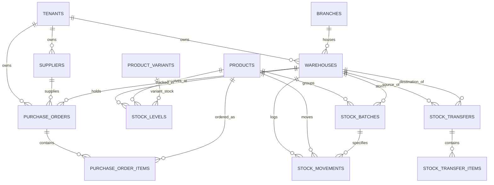

# PHASE 2 — Warehouse, Inventory & Procurement: Technical Blueprint

**Scope:** Warehouses, Multi-Location Stock Tracking, Batch/Lot & Expiry Management, Immutable Double-Entry Stock Movement Ledger, Stock Transfers, Stock Reservation Engine, Suppliers (CRM-Vendor), and Purchase Orders (Procurement Lifecycle).  
**Multi-Tenancy:** Strictly row-level isolated with `tenant_id` on all tables, PostgreSQL composite unique keys, UUIDv7 primary keys, and decimal precision for weights/volumes/monetary amounts.

---

## 1. Architecture Overview

Phase 2 builds the physical supply chain and inventory backbone of **ERPlannet**. It connects sales orders directly to warehouse fulfillment and connects procurement back to stock availability.

```
                           [ Tenant Context: tenant_id ]
                                         |
     +-----------------------------------+-----------------------------------+
     |                                   |                                   |
[ Suppliers (CRM-Vendor) ]        [ Warehouses ]                    [ Catalog (Phase 1) ]
     |                                   |                                   |
     v                                   v                                   v
[ Purchase Orders ]              [ Stock Levels ]                    [ Stock Batches / Lots ]
  - PO-2026-000001                 (physical, reserved, available)    - batch_number, mfg_date,
  - draft -> ordered -> received         |                              expiry_date, cost_price
     |                                   |                                   |
     +-----------------> [ Stock Movement Ledger ] <-------------------------+
                         (Immutable Double-Entry Ledger)
                         - Inbound (Goods Receipt / PO)
                         - Outbound (Order Fulfillment)
                         - Transfer (Warehouse A -> Warehouse B)
                         - Adjustment (Physical Count Audit)
                         - Scrap / Write-off (Damaged / Expired)
                         - Stock Reservation (Active Sales Orders)
```

### Key Principles

1. **Non-Destructive Append-Only Ledger (`stock_movements`):**
   Stock balances are never modified without a corresponding immutable ledger entry. The current balance in `stock_levels` is an ACID-compliant materialized balance updated atomically inside database transactions with pessimistic locks (`SELECT ... FOR UPDATE`).
2. **Three-Tier Balance Model:**
   - **Physical Quantity (`quantity_on_hand`):** Actual items currently in the warehouse bins.
   - **Reserved Quantity (`quantity_reserved`):** Items committed to confirmed/processing customer orders.
   - **Available Quantity (`quantity_available`):** `quantity_on_hand - quantity_reserved`. Sales orders can only commit up to `quantity_available`.
3. **Batch, Lot & Expiry Enforcement (Food & Pharma Safety):**
   Products with `has_batches = true` cannot be received or issued without assigning a valid batch number and expiration date. Batches track individual cost prices for accurate FIFO valuation.
4. **Two-Step Stock Transfers:**
   Transfers between warehouses support transit tracking (`draft` -> `in_transit` -> `completed` / `rejected`). In-transit items leave source physical stock and reside in an in-transit virtual balance until received by the destination warehouse.
5. **Procurement Workflow (Purchase Orders):**
   Purchase orders follow standard B2B lifecycle: `draft` -> `ordered` -> `partial_received` -> `received` (or `cancelled`). Receiving a PO automatically records goods receipt movements, creates batch records, and increments stock levels.
6. **Entitlement Quotas & Features:**
   - `limit.warehouses`: Numeric limit on active warehouses.
   - `limit.suppliers`: Numeric limit on active suppliers.
   - `feature.inventory_multi_warehouse`: Plan check for configuring > 1 warehouse.
   - `feature.batch_tracking`: Plan check for enabling batch/lot expiration tracking.

---

## 2. Database Schema & ERD

### 2.1 Entity Relationship Diagram



---

### 2.2 Core Table Definitions

#### A. Warehouses (`warehouses`)
```sql
CREATE TABLE warehouses (
    id UUID PRIMARY KEY,
    tenant_id UUID NOT NULL REFERENCES tenants(id) ON DELETE CASCADE,
    branch_id UUID NULL REFERENCES branches(id) ON DELETE SET NULL,
    code VARCHAR(50) NOT NULL,                    -- e.g. 'WH-MAIN', 'COLD-01'
    name VARCHAR(255) NOT NULL,
    type VARCHAR(50) NOT NULL DEFAULT 'standard', -- 'standard', 'production', 'retail', 'cold_storage'
    address TEXT NULL,
    is_active BOOLEAN NOT NULL DEFAULT TRUE,
    is_default BOOLEAN NOT NULL DEFAULT FALSE,
    settings JSONB NOT NULL DEFAULT '{}'::jsonb,
    created_at TIMESTAMPTZ NOT NULL DEFAULT NOW(),
    updated_at TIMESTAMPTZ NOT NULL DEFAULT NOW(),
    deleted_at TIMESTAMPTZ NULL,
    CONSTRAINT uq_warehouses_tenant_code UNIQUE (tenant_id, code)
);
CREATE INDEX idx_warehouses_tenant_active ON warehouses (tenant_id, is_active);
CREATE INDEX idx_warehouses_branch ON warehouses (tenant_id, branch_id);
```

#### B. Stock Levels (`stock_levels`)
```sql
CREATE TABLE stock_levels (
    id UUID PRIMARY KEY,
    tenant_id UUID NOT NULL REFERENCES tenants(id) ON DELETE CASCADE,
    warehouse_id UUID NOT NULL REFERENCES warehouses(id) ON DELETE CASCADE,
    product_id UUID NOT NULL REFERENCES products(id) ON DELETE CASCADE,
    product_variant_id UUID NULL REFERENCES product_variants(id) ON DELETE CASCADE,
    quantity_on_hand DECIMAL(15, 4) NOT NULL DEFAULT 0.0000,
    quantity_reserved DECIMAL(15, 4) NOT NULL DEFAULT 0.0000,
    quantity_available DECIMAL(15, 4) GENERATED ALWAYS AS (quantity_on_hand - quantity_reserved) STORED,
    reorder_point DECIMAL(15, 4) NOT NULL DEFAULT 0.0000,
    ideal_stock DECIMAL(15, 4) NOT NULL DEFAULT 0.0000,
    updated_at TIMESTAMPTZ NOT NULL DEFAULT NOW(),
    CONSTRAINT uq_stock_levels_item UNIQUE NULLS NOT DISTINCT (tenant_id, warehouse_id, product_id, product_variant_id)
);
CREATE INDEX idx_stock_levels_query ON stock_levels (tenant_id, warehouse_id, product_id);
```

#### C. Stock Batches / Lots (`stock_batches`)
```sql
CREATE TABLE stock_batches (
    id UUID PRIMARY KEY,
    tenant_id UUID NOT NULL REFERENCES tenants(id) ON DELETE CASCADE,
    warehouse_id UUID NOT NULL REFERENCES warehouses(id) ON DELETE CASCADE,
    product_id UUID NOT NULL REFERENCES products(id) ON DELETE CASCADE,
    product_variant_id UUID NULL REFERENCES product_variants(id) ON DELETE CASCADE,
    batch_number VARCHAR(100) NOT NULL,           -- e.g. 'LOT-202610-001'
    quantity_on_hand DECIMAL(15, 4) NOT NULL DEFAULT 0.0000,
    quantity_reserved DECIMAL(15, 4) NOT NULL DEFAULT 0.0000,
    cost_price DECIMAL(15, 4) NOT NULL DEFAULT 0.0000,
    mfg_date DATE NULL,
    expiry_date DATE NULL,
    status VARCHAR(50) NOT NULL DEFAULT 'active', -- 'active', 'quarantine', 'expired', 'exhausted'
    notes TEXT NULL,
    created_at TIMESTAMPTZ NOT NULL DEFAULT NOW(),
    updated_at TIMESTAMPTZ NOT NULL DEFAULT NOW(),
    CONSTRAINT uq_stock_batches_unique UNIQUE NULLS NOT DISTINCT (tenant_id, warehouse_id, product_id, product_variant_id, batch_number)
);
CREATE INDEX idx_stock_batches_expiry ON stock_batches (tenant_id, expiry_date, status);
```

#### D. Stock Movements (Immutable Ledger - `stock_movements`)
```sql
CREATE TABLE stock_movements (
    id UUID PRIMARY KEY,
    tenant_id UUID NOT NULL REFERENCES tenants(id) ON DELETE CASCADE,
    warehouse_id UUID NOT NULL REFERENCES warehouses(id) ON DELETE CASCADE,
    product_id UUID NOT NULL REFERENCES products(id) ON DELETE CASCADE,
    product_variant_id UUID NULL REFERENCES product_variants(id) ON DELETE SET NULL,
    stock_batch_id UUID NULL REFERENCES stock_batches(id) ON DELETE SET NULL,
    user_id UUID NULL REFERENCES users(id) ON DELETE SET NULL,
    type VARCHAR(50) NOT NULL,                    -- 'purchase_receipt', 'sale_delivery', 'transfer_out', 'transfer_in', 'adjustment_plus', 'adjustment_minus', 'scrap', 'production_consume', 'production_yield'
    quantity DECIMAL(15, 4) NOT NULL,             -- Signed or absolute based on type (stored positive with type indicator)
    unit_cost DECIMAL(15, 4) NOT NULL DEFAULT 0.0000,
    balance_before DECIMAL(15, 4) NOT NULL,
    balance_after DECIMAL(15, 4) NOT NULL,
    reference_type VARCHAR(100) NULL,             -- 'App\Domain\Procurement\Models\PurchaseOrder', 'App\Domain\Sales\Models\Order', 'App\Domain\Warehouse\Models\StockTransfer'
    reference_id UUID NULL,
    notes TEXT NULL,
    created_at TIMESTAMPTZ NOT NULL DEFAULT NOW()
);
CREATE INDEX idx_stock_movements_tenant_history ON stock_movements (tenant_id, warehouse_id, product_id, created_at DESC);
CREATE INDEX idx_stock_movements_reference ON stock_movements (tenant_id, reference_type, reference_id);
```

#### E. Stock Transfers (`stock_transfers` & `stock_transfer_items`)
```sql
CREATE TABLE stock_transfers (
    id UUID PRIMARY KEY,
    tenant_id UUID NOT NULL REFERENCES tenants(id) ON DELETE CASCADE,
    transfer_number VARCHAR(50) NOT NULL,         -- TRF-2026-000001
    source_warehouse_id UUID NOT NULL REFERENCES warehouses(id) ON DELETE RESTRICT,
    destination_warehouse_id UUID NOT NULL REFERENCES warehouses(id) ON DELETE RESTRICT,
    status VARCHAR(50) NOT NULL DEFAULT 'draft',  -- 'draft', 'in_transit', 'completed', 'cancelled'
    user_id UUID NOT NULL REFERENCES users(id) ON DELETE RESTRICT,
    notes TEXT NULL,
    shipped_at TIMESTAMPTZ NULL,
    received_at TIMESTAMPTZ NULL,
    created_at TIMESTAMPTZ NOT NULL DEFAULT NOW(),
    updated_at TIMESTAMPTZ NOT NULL DEFAULT NOW(),
    CONSTRAINT uq_transfers_number UNIQUE (tenant_id, transfer_number),
    CONSTRAINT chk_transfers_different_warehouses CHECK (source_warehouse_id <> destination_warehouse_id)
);

CREATE TABLE stock_transfer_items (
    id UUID PRIMARY KEY,
    tenant_id UUID NOT NULL REFERENCES tenants(id) ON DELETE CASCADE,
    stock_transfer_id UUID NOT NULL REFERENCES stock_transfers(id) ON DELETE CASCADE,
    product_id UUID NOT NULL REFERENCES products(id) ON DELETE RESTRICT,
    product_variant_id UUID NULL REFERENCES product_variants(id) ON DELETE SET NULL,
    stock_batch_id UUID NULL REFERENCES stock_batches(id) ON DELETE SET NULL,
    quantity DECIMAL(15, 4) NOT NULL,
    created_at TIMESTAMPTZ NOT NULL DEFAULT NOW()
);
```

#### F. Suppliers / Vendors (`suppliers`)
```sql
CREATE TABLE suppliers (
    id UUID PRIMARY KEY,
    tenant_id UUID NOT NULL REFERENCES tenants(id) ON DELETE CASCADE,
    company_name VARCHAR(255) NOT NULL,
    legal_name VARCHAR(255) NULL,
    tax_id VARCHAR(100) NULL,                     -- HVHH in Armenia
    contact_person VARCHAR(150) NULL,
    email VARCHAR(255) NULL,
    phone VARCHAR(50) NOT NULL,
    address TEXT NULL,
    bank_name VARCHAR(255) NULL,
    bank_account VARCHAR(100) NULL,
    currency VARCHAR(3) NOT NULL DEFAULT 'AMD',
    payment_terms_days INT NOT NULL DEFAULT 0,
    is_active BOOLEAN NOT NULL DEFAULT TRUE,
    notes TEXT NULL,
    created_at TIMESTAMPTZ NOT NULL DEFAULT NOW(),
    updated_at TIMESTAMPTZ NOT NULL DEFAULT NOW(),
    deleted_at TIMESTAMPTZ NULL,
    CONSTRAINT uq_suppliers_tenant_tax UNIQUE NULLS NOT DISTINCT (tenant_id, tax_id)
);
CREATE INDEX idx_suppliers_tenant_active ON suppliers (tenant_id, is_active);
```

#### G. Purchase Orders (`purchase_orders` & `purchase_order_items`)
```sql
CREATE TABLE purchase_orders (
    id UUID PRIMARY KEY,
    tenant_id UUID NOT NULL REFERENCES tenants(id) ON DELETE CASCADE,
    po_number VARCHAR(50) NOT NULL,               -- PO-2026-000001
    supplier_id UUID NOT NULL REFERENCES suppliers(id) ON DELETE RESTRICT,
    warehouse_id UUID NOT NULL REFERENCES warehouses(id) ON DELETE RESTRICT,
    user_id UUID NOT NULL REFERENCES users(id) ON DELETE RESTRICT,
    status VARCHAR(50) NOT NULL DEFAULT 'draft',  -- 'draft', 'ordered', 'partial_received', 'received', 'cancelled'
    order_date DATE NOT NULL DEFAULT CURRENT_DATE,
    expected_delivery_date DATE NULL,
    received_at TIMESTAMPTZ NULL,
    subtotal DECIMAL(15, 4) NOT NULL DEFAULT 0.0000,
    tax_amount DECIMAL(15, 4) NOT NULL DEFAULT 0.0000,
    total DECIMAL(15, 4) NOT NULL DEFAULT 0.0000,
    currency VARCHAR(3) NOT NULL DEFAULT 'AMD',
    payment_status VARCHAR(50) NOT NULL DEFAULT 'unpaid', -- 'unpaid', 'partially_paid', 'paid'
    notes TEXT NULL,
    created_at TIMESTAMPTZ NOT NULL DEFAULT NOW(),
    updated_at TIMESTAMPTZ NOT NULL DEFAULT NOW(),
    deleted_at TIMESTAMPTZ NULL,
    CONSTRAINT uq_po_tenant_number UNIQUE (tenant_id, po_number)
);

CREATE TABLE purchase_order_items (
    id UUID PRIMARY KEY,
    tenant_id UUID NOT NULL REFERENCES tenants(id) ON DELETE CASCADE,
    purchase_order_id UUID NOT NULL REFERENCES purchase_orders(id) ON DELETE CASCADE,
    product_id UUID NOT NULL REFERENCES products(id) ON DELETE RESTRICT,
    product_variant_id UUID NULL REFERENCES product_variants(id) ON DELETE SET NULL,
    quantity_ordered DECIMAL(15, 4) NOT NULL,
    quantity_received DECIMAL(15, 4) NOT NULL DEFAULT 0.0000,
    unit_cost DECIMAL(15, 4) NOT NULL,
    total DECIMAL(15, 4) NOT NULL,
    created_at TIMESTAMPTZ NOT NULL DEFAULT NOW(),
    updated_at TIMESTAMPTZ NOT NULL DEFAULT NOW()
);
```

---

## 3. Core Business Logic & State Machines

### 3.1 Purchase Order Lifecycle State Machine

```
  [ Draft ] ----------> [ Ordered ] ----------> [ Received ]
     |                      |                         ^
     |                      v                         |
     |              [ Partial Received ] -------------+
     |                      |
     v                      v
  [ Cancelled ] <-----------+
```

1. **`draft`:** Initial PO creation. Items, costs, and expected delivery date can be modified.
2. **`ordered`:** PO finalized and issued to supplier. Changes locked.
3. **`received` / `partial_received`:** Triggered through `ReceiveGoodsAction`. Automatically:
   - Increments `stock_levels.quantity_on_hand`.
   - Creates or updates `stock_batches` with batch numbers and expiry dates.
   - Appends entries to `stock_movements` (type `purchase_receipt`).
   - Updates `products.cost_price` using Weighted Average Costing (WAC).
4. **`cancelled`:** Can only be cancelled if `quantity_received == 0`.

---

### 3.2 Inventory Reservation & Order Deduction Workflow

Phase 2 seamlessly hooks into Phase 1 `Order` transitions:

```
[ Sales Order: New / Confirmed ]
       |
       v
[ ReserveStockAction ]
  - Checks if quantity_available >= requested
  - Locks stock_levels row (SELECT FOR UPDATE)
  - quantity_reserved += requested
  - (No physical deduction yet)
       |
       v
[ Sales Order: Delivered / Completed ]
       |
       v
[ DeductReservedStockAction ]
  - quantity_on_hand -= requested
  - quantity_reserved -= requested
  - Appends to stock_movements (type: 'sale_delivery', reference: Order)
       |
       +---> [ If Cancelled at any point ]
             v
             [ ReleaseStockAction ]
             - quantity_reserved -= requested (restores available stock)
```

---

### 3.3 Two-Step Stock Transfer Workflow

```
[ Draft Transfer ]
       |
       v
[ ShipTransferAction ]
  - Locks source warehouse stock_levels
  - Deducts source warehouse quantity_on_hand
  - Logs stock_movement (type: 'transfer_out')
  - Transfer status -> 'in_transit'
       |
       v
[ ReceiveTransferAction ]
  - Locks destination warehouse stock_levels
  - Increments destination warehouse quantity_on_hand
  - Logs stock_movement (type: 'transfer_in')
  - Transfer status -> 'completed'
```

---

## 4. Entitlements & Multi-Tenancy Security

The following entitlements will be strictly checked in Phase 2 controllers and actions:

| Entitlement Key | Type | Description | Starter Plan | Growth Plan | Enterprise Plan |
| :--- | :--- | :--- | :--- | :--- | :--- |
| `limit.warehouses` | Numeric Quota | Max active warehouses per tenant | 1 | 5 | Unlimited (999) |
| `limit.suppliers` | Numeric Quota | Max active suppliers per tenant | 5 | 50 | Unlimited (9999) |
| `feature.inventory_multi_warehouse` | Feature Flag | Ability to add > 1 warehouse | ❌ False | ✅ True | ✅ True |
| `feature.batch_tracking` | Feature Flag | Lot/Batch numbers & expiration tracking | ❌ False | ✅ True | ✅ True |

All queries execute with the global `TenantScope` and `BelongsToTenant` trait. Any attempt to cross-link a warehouse or supplier belonging to another tenant fails with HTTP 404/403.

---

## 5. REST API Specification

### 5.1 Warehouse Endpoints
- `GET /api/v1/warehouses` — List all tenant warehouses
- `POST /api/v1/warehouses` — Create warehouse (checks `limit.warehouses` & `feature.inventory_multi_warehouse`)
- `GET /api/v1/warehouses/{id}` — Warehouse details & current stock summary
- `PUT /api/v1/warehouses/{id}` — Update warehouse details
- `DELETE /api/v1/warehouses/{id}` — Soft delete warehouse (disallowed if stock exists)

### 5.2 Stock & Inventory Endpoints
- `GET /api/v1/inventory/levels` — Real-time stock levels across warehouses (filterable by warehouse, product, low-stock)
- `GET /api/v1/inventory/batches` — List batches, expiry dates, and lot quantities
- `GET /api/v1/inventory/movements` — Immutable audit log of all stock transactions
- `POST /api/v1/inventory/adjust` — Manual inventory count adjustment (`adjustment_plus` / `adjustment_minus` / `scrap`)
- `GET /api/v1/inventory/transfers` — List stock transfers
- `POST /api/v1/inventory/transfers` — Create transfer (`draft`)
- `POST /api/v1/inventory/transfers/{id}/ship` — Dispatch transfer (`in_transit`)
- `POST /api/v1/inventory/transfers/{id}/receive` — Complete transfer at destination

### 5.3 Supplier & Procurement Endpoints
- `GET /api/v1/suppliers` — List suppliers
- `POST /api/v1/suppliers` — Create supplier (checks `limit.suppliers`)
- `GET /api/v1/suppliers/{id}` — Supplier details with order history
- `PUT /api/v1/suppliers/{id}` — Update supplier
- `DELETE /api/v1/suppliers/{id}` — Soft delete supplier
- `GET /api/v1/purchase-orders` — List purchase orders
- `POST /api/v1/purchase-orders` — Create PO (`draft`)
- `GET /api/v1/purchase-orders/{id}` — PO details & line items
- `POST /api/v1/purchase-orders/{id}/submit` — Transition to `ordered`
- `POST /api/v1/purchase-orders/{id}/receive` — Receive goods into warehouse & generate batches/movements
- `POST /api/v1/purchase-orders/{id}/cancel` — Cancel PO

---

## 6. Implementation Deliverables

1. **Migrations:**
   - `0001_01_01_000015_create_warehouses_table.php`
   - `0001_01_01_000016_create_inventory_tables.php` (`stock_levels`, `stock_batches`, `stock_movements`, `stock_transfers`, `stock_transfer_items`)
   - `0001_01_01_000017_create_procurement_tables.php` (`suppliers`, `purchase_orders`, `purchase_order_items`)
2. **Domain Models (`app/Domain/Warehouse` & `app/Domain/Procurement`):**
   - `Warehouse`, `StockLevel`, `StockBatch`, `StockMovement`, `StockTransfer`, `StockTransferItem`
   - `Supplier`, `PurchaseOrder`, `PurchaseOrderItem`
3. **Actions & Services:**
   - `CreateWarehouseAction` (entitlement-aware)
   - `RecordStockMovementAction` (handles database lock & atomic level update)
   - `AdjustStockAction`
   - `TransferStockAction`
   - `CreateSupplierAction`
   - `CreatePurchaseOrderAction` (sequential PO generator `PO-YYYY-NNNNNN`)
   - `ReceivePurchaseOrderAction` (creates batches, movements, and updates WAC cost)
4. **Controllers & Form Requests:**
   - Standard RESTful API controllers with validation and JSON envelopes.
5. **Seeders:**
   - Updated `DemoTenantSeeder` with:
     - Main Warehouse (`WH-MAIN`) & Cold Storage Warehouse (`WH-COLD`)
     - Suppliers (e.g. «Արարատ Ֆերմա» ՍՊԸ, «Էջմիածին Ալյուր» ՍՊԸ)
     - Initial stock levels and batches with realistic expiration dates
     - Sample Purchase Order (`PO-2026-000001`) in `received` state
6. **Automated Tests:**
   - Comprehensive feature tests covering:
     - Multi-tenant isolation for all inventory & supplier records
     - Stock level reservation & balance accuracy
     - Double-entry movement mathematical consistency
     - PO receiving workflow & batch creation
     - Entitlement limit enforcement (`limit.warehouses`, `limit.suppliers`, `feature.inventory_multi_warehouse`)

---

## 7. Approval & Feedback Request

This blueprint provides the complete architecture and technical implementation plan for **Phase 2**.  
Please review the architecture and confirm if you approve proceeding with the code implementation.
