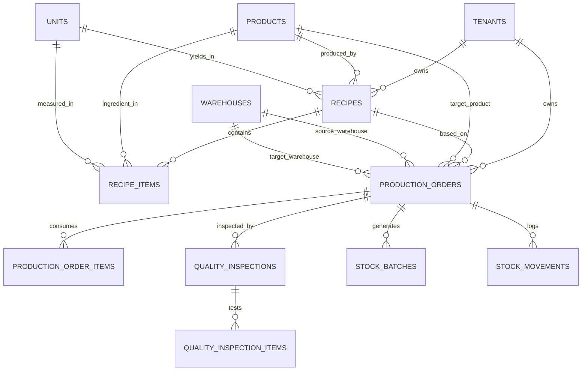

# PHASE 3 — Manufacturing, Recipes (BOM), Production Orders & Quality Assurance / ISO 22000: Technical Blueprint

**Scope:** Recipes / Bill of Materials (BOM), Production Orders (Work Orders), Material Consumption & Output Yield, Automated Cost Calculation, Stock Batch Generation with Shelf-Life Expiry, and Quality Assurance / ISO 22000 & HACCP Inspection Gating.  
**Multi-Tenancy:** Strictly row-level isolated with `tenant_id` on all tables, PostgreSQL composite unique keys, UUIDv7 primary keys, and decimal precision for ingredients, yields, costs, and quality metrics.

---

## 1. Architecture Overview

Phase 3 introduces the transformation engine of **ERPlannet**, bridging warehouse raw materials with finished goods inventory while enforcing food safety and ISO 22000 / HACCP quality compliance.

```
                             [ Tenant Context: tenant_id ]
                                           |
       +-----------------------------------+-----------------------------------+
       |                                   |                                   |
[ Catalog (Phase 1) ]             [ Recipes / BOM ]                 [ Warehouses (Phase 2) ]
  - Raw Materials                   - version, yield_quantity         - Source WH (Ingredients)
  - Finished Goods                  - scrap_percentage                - Target WH (Finished Goods)
  - Shelf life days                 - BOM Items (quantity, waste)              |
       |                            - Instructions & CCP checks                |
       +-----------------------------------+-----------------------------------+
                                           |
                                           v
                             [ Production Orders Engine ]
                             - PRD-2026-000001
                             - Lifecycle State Machine:
                               [ Draft ] -> [ Confirmed ] -> [ In Progress ] -> [ Quality Check ] -> [ Completed ]
                                                    \               \                    \-> [ Rejected ]
                                                     \---------------\-> [ Cancelled ]
                                           |
     +-------------------------------------+-------------------------------------+
     |                                                                           |
     v                                                                           v
[ Stock Movements (Phase 2) ]                                       [ Quality Assurance / ISO 22000 ]
  - In Progress: type 'production_consume' (Ingredients deducted)     - Critical Control Points (CCP)
  - Completed:   type 'production_yield' (Finished goods added)       - Parameter inspection (min, max, actual)
  - Finished goods Batch created with automatic Expiry Date           - Pass / Deviation / Fail Gating
```

### Key Principles

1. **Bill of Materials (BOM) & Recipe Formulation:**
   A recipe defines the exact ratio of ingredients required to produce a specified output yield (e.g. 100 kg dough yields 80 kg baked bread, with 5% expected baking moisture loss / scrap). Recipes support versioning (`version = '1.0'`), labor cost, and overhead cost.
2. **Atomic Inventory Lifecycle Integration:**
   - **`confirmed`:** Ingredients are verified for availability.
   - **`in_progress`:** Real-time stock movements of type `production_consume` deduct ingredients from the source warehouse.
   - **`completed`:** Stock movement of type `production_yield` credits finished goods to the target warehouse, and creates a fresh `StockBatch` with automatic expiration calculation based on the product's shelf-life.
3. **Accurate Finished Good Cost Computation:**
   Unit production cost is calculated dynamically from consumed ingredient costs + allocated labor & machine overhead:
   $$\text{Unit Cost} = \frac{\sum(\text{Ingredient Quantity} \times \text{Ingredient Unit Cost}) + \text{Labor Cost} + \text{Overhead Cost}}{\text{Actual Finished Good Yield}}$$
4. **ISO 22000 & HACCP Quality Assurance Gating:**
   In food production and regulated manufacturing, goods cannot enter sellable inventory without meeting Critical Control Point (CCP) thresholds (e.g., core baking temperature $\ge 92^\circ\text{C}$, moisture $\le 14\%$, pH level $5.2 - 5.6$, metal detector check: `pass`). If inspections fail, the order is flagged `rejected` and routed to scrap/rework.
5. **Entitlement Quotas & Tiering:**
   - `feature.production`: Required to create recipes and production orders (Growth & Enterprise plans).
   - `feature.iso22000`: Required for HACCP / ISO 22000 Quality Assurance inspections (Enterprise plan).
   - `limit.recipes`: Numeric quota on active recipes.
   - `limit.production_orders_monthly`: Monthly production orders quota.

---

## 2. Database Schema & ERD

### 2.1 Entity Relationship Diagram



---

### 2.2 Core Table Definitions

#### A. Shelf Life Column in Products
```sql
ALTER TABLE products ADD COLUMN shelf_life_days INT NULL;
```

#### B. Recipes / BOM (`recipes` & `recipe_items`)
```sql
CREATE TABLE recipes (
    id UUID PRIMARY KEY,
    tenant_id UUID NOT NULL REFERENCES tenants(id) ON DELETE CASCADE,
    product_id UUID NOT NULL REFERENCES products(id) ON DELETE RESTRICT,
    product_variant_id UUID NULL REFERENCES product_variants(id) ON DELETE SET NULL,
    code VARCHAR(50) NOT NULL,                    -- e.g. 'RCP-MATNAKASH-V1'
    name VARCHAR(255) NOT NULL,
    version VARCHAR(20) NOT NULL DEFAULT '1.0',
    yield_quantity DECIMAL(15, 4) NOT NULL,       -- Base output quantity (e.g. 100)
    yield_unit_id UUID NOT NULL REFERENCES units(id) ON DELETE RESTRICT,
    scrap_percentage DECIMAL(5, 2) NOT NULL DEFAULT 0.00, -- e.g. 5.00%
    labor_cost DECIMAL(15, 4) NOT NULL DEFAULT 0.0000,
    overhead_cost DECIMAL(15, 4) NOT NULL DEFAULT 0.0000,
    instructions TEXT NULL,
    is_active BOOLEAN NOT NULL DEFAULT TRUE,
    created_at TIMESTAMPTZ NOT NULL DEFAULT NOW(),
    updated_at TIMESTAMPTZ NOT NULL DEFAULT NOW(),
    deleted_at TIMESTAMPTZ NULL,
    CONSTRAINT uq_recipes_tenant_code UNIQUE (tenant_id, code)
);
CREATE INDEX idx_recipes_tenant_product ON recipes (tenant_id, product_id, is_active);

CREATE TABLE recipe_items (
    id UUID PRIMARY KEY,
    tenant_id UUID NOT NULL REFERENCES tenants(id) ON DELETE CASCADE,
    recipe_id UUID NOT NULL REFERENCES recipes(id) ON DELETE CASCADE,
    product_id UUID NOT NULL REFERENCES products(id) ON DELETE RESTRICT, -- Raw material / ingredient
    product_variant_id UUID NULL REFERENCES product_variants(id) ON DELETE SET NULL,
    quantity DECIMAL(15, 4) NOT NULL,             -- Required ingredient quantity
    unit_id UUID NOT NULL REFERENCES units(id) ON DELETE RESTRICT,
    waste_percentage DECIMAL(5, 2) NOT NULL DEFAULT 0.00,
    sort_order INT NOT NULL DEFAULT 0,
    notes VARCHAR(255) NULL,
    created_at TIMESTAMPTZ NOT NULL DEFAULT NOW()
);
```

#### C. Production Orders (`production_orders` & `production_order_items`)
```sql
CREATE TABLE production_orders (
    id UUID PRIMARY KEY,
    tenant_id UUID NOT NULL REFERENCES tenants(id) ON DELETE CASCADE,
    order_number VARCHAR(50) NOT NULL,            -- e.g. 'PRD-2026-000001'
    recipe_id UUID NOT NULL REFERENCES recipes(id) ON DELETE RESTRICT,
    product_id UUID NOT NULL REFERENCES products(id) ON DELETE RESTRICT,
    product_variant_id UUID NULL REFERENCES product_variants(id) ON DELETE SET NULL,
    source_warehouse_id UUID NOT NULL REFERENCES warehouses(id) ON DELETE RESTRICT,
    target_warehouse_id UUID NOT NULL REFERENCES warehouses(id) ON DELETE RESTRICT,
    user_id UUID NOT NULL REFERENCES users(id) ON DELETE RESTRICT,
    status VARCHAR(50) NOT NULL DEFAULT 'draft',  -- 'draft', 'confirmed', 'in_progress', 'quality_check', 'completed', 'rejected', 'cancelled'
    planned_quantity DECIMAL(15, 4) NOT NULL,
    actual_quantity DECIMAL(15, 4) NOT NULL DEFAULT 0.0000,
    waste_quantity DECIMAL(15, 4) NOT NULL DEFAULT 0.0000,
    unit_cost DECIMAL(15, 4) NOT NULL DEFAULT 0.0000,
    total_cost DECIMAL(15, 4) NOT NULL DEFAULT 0.0000,
    stock_batch_id UUID NULL REFERENCES stock_batches(id) ON DELETE SET NULL,
    planned_start_date DATE NOT NULL DEFAULT CURRENT_DATE,
    started_at TIMESTAMPTZ NULL,
    completed_at TIMESTAMPTZ NULL,
    notes TEXT NULL,
    created_at TIMESTAMPTZ NOT NULL DEFAULT NOW(),
    updated_at TIMESTAMPTZ NOT NULL DEFAULT NOW(),
    deleted_at TIMESTAMPTZ NULL,
    CONSTRAINT uq_production_orders_tenant_number UNIQUE (tenant_id, order_number)
);
CREATE INDEX idx_production_orders_status ON production_orders (tenant_id, status);

CREATE TABLE production_order_items (
    id UUID PRIMARY KEY,
    tenant_id UUID NOT NULL REFERENCES tenants(id) ON DELETE CASCADE,
    production_order_id UUID NOT NULL REFERENCES production_orders(id) ON DELETE CASCADE,
    product_id UUID NOT NULL REFERENCES products(id) ON DELETE RESTRICT,
    product_variant_id UUID NULL REFERENCES product_variants(id) ON DELETE SET NULL,
    planned_quantity DECIMAL(15, 4) NOT NULL,
    consumed_quantity DECIMAL(15, 4) NOT NULL DEFAULT 0.0000,
    unit_cost DECIMAL(15, 4) NOT NULL DEFAULT 0.0000,
    total_cost DECIMAL(15, 4) NOT NULL DEFAULT 0.0000,
    stock_batch_id UUID NULL REFERENCES stock_batches(id) ON DELETE SET NULL,
    created_at TIMESTAMPTZ NOT NULL DEFAULT NOW()
);
```

#### D. Quality Assurance & ISO 22000 Inspections (`quality_inspections` & `quality_inspection_items`)
```sql
CREATE TABLE quality_inspections (
    id UUID PRIMARY KEY,
    tenant_id UUID NOT NULL REFERENCES tenants(id) ON DELETE CASCADE,
    production_order_id UUID NOT NULL REFERENCES production_orders(id) ON DELETE CASCADE,
    inspector_id UUID NOT NULL REFERENCES users(id) ON DELETE RESTRICT,
    inspection_number VARCHAR(50) NOT NULL,       -- e.g. 'QA-2026-000001'
    status VARCHAR(50) NOT NULL DEFAULT 'passed', -- 'passed', 'deviation_accepted', 'failed'
    standard_applied VARCHAR(100) NOT NULL DEFAULT 'ISO 22000:2018', -- 'HACCP', 'ISO 22000:2018', 'Internal GMP'
    overall_score DECIMAL(5, 2) NULL,             -- e.g. 98.50%
    notes TEXT NULL,
    inspected_at TIMESTAMPTZ NOT NULL DEFAULT NOW(),
    created_at TIMESTAMPTZ NOT NULL DEFAULT NOW(),
    CONSTRAINT uq_qa_inspections_number UNIQUE (tenant_id, inspection_number)
);

CREATE TABLE quality_inspection_items (
    id UUID PRIMARY KEY,
    tenant_id UUID NOT NULL REFERENCES tenants(id) ON DELETE CASCADE,
    quality_inspection_id UUID NOT NULL REFERENCES quality_inspections(id) ON DELETE CASCADE,
    parameter_name VARCHAR(150) NOT NULL,         -- e.g. 'Core Baking Temperature', 'Moisture Content', 'Coliform Count'
    critical_control_point VARCHAR(50) NULL,      -- e.g. 'CCP-1 (Thermal Treatment)', 'CCP-2 (Metal Detection)'
    target_value VARCHAR(100) NULL,               -- e.g. '95.0'
    min_value DECIMAL(12, 4) NULL,                -- e.g. 92.0000
    max_value DECIMAL(12, 4) NULL,                -- e.g. 98.0000
    actual_value VARCHAR(100) NOT NULL,           -- e.g. '94.6' or 'negative'
    unit VARCHAR(30) NULL,                        -- e.g. '°C', '%', 'pH', 'CFU/g'
    is_passed BOOLEAN NOT NULL DEFAULT TRUE,
    deviation_notes TEXT NULL,
    created_at TIMESTAMPTZ NOT NULL DEFAULT NOW()
);
```

---

## 3. Core Business Logic & State Machines

### 3.1 Production Order State Machine

```
  [ Draft ] ----------> [ Confirmed ] ----------> [ In Progress ]
     |                       |                          |
     | (Cancel)              | (Cancel & Release)       v
     |                       |                  [ Quality Check ]
     v                       v                          |
  [ Cancelled ] <------------+                  +-------+-------+
                                                |               |
                                             (Pass)          (Fail)
                                                v               v
                                         [ Completed ]    [ Rejected ]
```

1. **`draft` &rarr; `confirmed`:**
   Validates recipe validity, checks ingredient inventory availability in `source_warehouse`.
2. **`confirmed` &rarr; `in_progress`:**
   Dispatches materials: executes `RecordStockMovementAction` (type `production_consume`) for all required ingredient quantities. Sets `started_at = now()`.
3. **`in_progress` &rarr; `quality_check`:**
   Production finishes processing physically. If the tenant has `feature.iso22000`, a QA inspection ticket is created.
4. **`quality_check` &rarr; `completed`:**
   - Validates that mandatory QA checks passed (or bypass if ISO module not enabled).
   - Generates output `StockBatch` with automatic expiration:
     $$\text{Expiry Date} = \text{now()} + \text{product.shelf\_life\_days}$$
   - Executes `RecordStockMovementAction` (type `production_yield`) adding finished goods to `target_warehouse`.
   - Recomputes unit cost:
     $$\text{Unit Cost} = \frac{\text{Total Actual Material Cost} + \text{Labor Cost} + \text{Overhead Cost}}{\text{actual\_quantity}}$$
   - Updates `products.cost_price` to reflect latest manufacturing cost.
5. **`quality_check` &rarr; `rejected`:**
   If QA fails (e.g. microbial contamination, undercooked, metal detected), finished goods are rejected and cannot enter sellable stock. The user can optionally write-off consumed materials as `scrap`.

---

### 3.2 Recipe Ingredient Scaling Formula

When creating a production order for $Q_{\text{planned}}$, all recipe items are automatically scaled:

$$\text{Required Quantity}_i = \frac{Q_{\text{planned}}}{Q_{\text{recipe\_yield}}} \times \text{Ingredient Quantity}_i \times \left(1 + \frac{\text{Waste } \%_i}{100}\right)$$

---

## 4. Entitlements & Multi-Tenancy Security

| Entitlement Key | Type | Description | Starter Plan | Growth Plan | Enterprise Plan |
| :--- | :--- | :--- | :--- | :--- | :--- |
| `feature.production` | Boolean Flag | Manufacturing & Recipes | ❌ False | ✅ True | ✅ True |
| `feature.iso22000` | Boolean Flag | HACCP / ISO 22000 Quality Assurance | ❌ False | ❌ False | ✅ True |
| `limit.recipes` | Numeric Quota | Max active recipes | 0 | 50 | Unlimited (999) |
| `limit.production_orders_monthly` | Numeric Quota | Max monthly production runs | 0 | 500 | Unlimited (9999) |

---

## 5. REST API Specification

### 5.1 Recipe Management Endpoints
- `GET /api/v1/recipes` — List recipes (filterable by product, active status)
- `POST /api/v1/recipes` — Create recipe & ingredient items (checks `feature.production` & `limit.recipes`)
- `GET /api/v1/recipes/{id}` — Recipe details with ingredient cost breakdown & instructions
- `PUT /api/v1/recipes/{id}` — Update recipe & BOM lines
- `DELETE /api/v1/recipes/{id}` — Soft delete recipe

### 5.2 Production Order Endpoints
- `GET /api/v1/production-orders` — List production orders (filterable by status, warehouse, date range)
- `POST /api/v1/production-orders` — Create production order (scales ingredients automatically from recipe)
- `GET /api/v1/production-orders/{id}` — Detailed order with consumed items, costs, and inspection history
- `POST /api/v1/production-orders/{id}/confirm` — Confirm order (validates ingredient stock)
- `POST /api/v1/production-orders/{id}/start` — Start production (deducts raw material stock via `production_consume`)
- `POST /api/v1/production-orders/{id}/complete` — Finish production & yield finished goods batch (`production_yield`)
- `POST /api/v1/production-orders/{id}/cancel` — Cancel production order

### 5.3 Quality Assurance & ISO 22000 Endpoints
- `GET /api/v1/quality-inspections` — List QA inspections
- `POST /api/v1/production-orders/{id}/inspect` — Record CCP inspection checklist (checks `feature.iso22000`)
- `GET /api/v1/quality-inspections/{id}` — Inspection report with parameter tolerances & audit findings

---

## 6. Implementation Deliverables

1. **Migrations:**
   - `0001_01_01_000018_create_recipes_tables.php`
   - `0001_01_01_000019_create_production_orders_tables.php`
   - `0001_01_01_000020_create_quality_assurance_tables.php`
2. **Domain Models (`app/Domain/Manufacturing` & `app/Domain/Quality`):**
   - `Recipe`, `RecipeItem`, `ProductionOrder`, `ProductionOrderItem`
   - `QualityInspection`, `QualityInspectionItem`
3. **Actions & Services:**
   - `CreateRecipeAction`
   - `ProductionOrderNumberGenerator` (`PRD-YYYY-NNNNNN`)
   - `CreateProductionOrderAction` (BOM scaling algorithm)
   - `StartProductionOrderAction` (ingredient deduction via `RecordStockMovementAction`)
   - `CompleteProductionOrderAction` (WAC costing, batch generation with shelf-life expiry, finished goods yield)
   - `RecordQualityInspectionAction` (HACCP parameter validation & CCP gating)
4. **Controllers & Form Requests:**
   - RESTful controllers under `App\Http\Controllers\Api\V1\Tenant\Manufacturing` and `Quality`
5. **Seeders:**
   - Real-world food recipes seeded for «Armenia Gourmet Food»:
     - **Թոնրի Մատնաքաշի Բաղադրատոմս** (Ալյուր Բ/Տ, Ջուր, Կերակրի Աղ, Խմորիչ &rarr; 100 հատ մատնաքաշ)
     - **Լոռի Պանրի Բաղադրատոմս** (Կաթ պաստերիզացված, Մակարդ, Աղաջուր &rarr; 10 կգ պանիր)
     - **Տավարի Բաստուրմայի Բաղադրատոմս** (Տավարի ֆիլե, Չաման, Սխտոր, Կարմիր պղպեղ &rarr; 5 կգ բաստուրմա)
   - Sample completed Production Order with ISO 22000 QA pass inspection certificate.
6. **Automated Feature Tests:**
   - Complete feature test suite testing recipe calculation, BOM scaling, raw material deduction, finished goods batching, shelf-life calculation, and ISO 22000 inspection gating.

---

## 7. Approval & Feedback Request

This blueprint outlines the complete architecture and implementation specifications for **Phase 3**.  
Please review the architecture and confirm if you approve proceeding with the code implementation.
