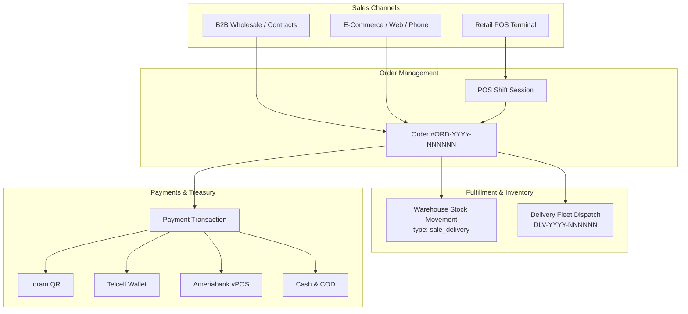
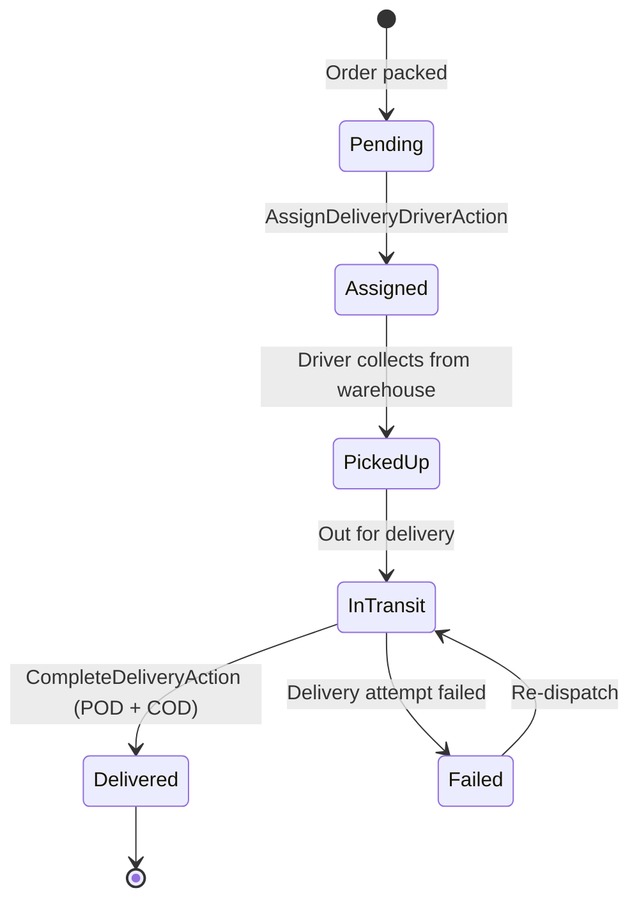

# Phase 4 — Technical Blueprint: Sales Channels, POS, Delivery Fleet & Payment Gateways

> **Platform:** ERPlannet Multi-Tenant SaaS ERP / CRM / POS  
> **Phase Target:** Phase 4 — Omnichannel Sales, POS (Point of Sale), Order Dispatch, Delivery Fleet & Payment Gateways  
> **Stack:** Laravel 13, PHP 8.5, PostgreSQL 18, Redis 7, Tailwind CSS  
> **Status:** Pending User Approval  

---

## 1. Executive Summary & Architecture Scope

Phase 4 builds the commercial transaction engine of **ERPlannet**, bridging inventory, manufacturing, and customer fulfillment across multiple sales channels:
1. **Omnichannel Sales Engine:**
   - **B2B Wholesale Orders:** Bulk pricing, credit terms, customer tax ID validation, scheduled dispatch.
   - **Retail POS (Point of Sale):** Fast cashier interface, barcode scanner support, receipt generation (`REC-YYYY-NNNNNN`), split payments (cash + card + QR).
   - **E-Commerce / Direct Orders:** Delivery address routing, time slot scheduling, automatic stock reservation.
2. **POS Subsystem (Shift & Cash Register Management):**
   - Terminals (`pos_terminals`), Cashier Sessions (`pos_sessions` with opening cash, closing cash declaration, variance calculation).
   - Cash In / Cash Out drawer drops (`pos_cash_movements`).
   - High-speed checkout action depleting stock in real-time from the terminal's assigned branch/warehouse.
3. **Delivery & Fleet Management Subsystem:**
   - Couriers & Vehicles (`delivery_drivers`): status (`available`, `on_delivery`, `offline`).
   - Dispatch Shipments (`delivery_shipments`): tracking number `DLV-YYYY-NNNNNN`, scheduled time window, status progression (`pending` $\to$ `assigned` $\to$ `picked_up` $\to$ `in_transit` $\to$ `delivered` / `failed`).
   - Proof of Delivery (`delivery_proofs`): digital signature, delivery photo URL, recipient notes, GPS coordinates.
   - Cash-on-Delivery (COD) reconciliation: tracking cash collected by courier and deposited into treasury.
4. **Armenian & International Payment Gateway Architecture:**
   - Strategy Pattern with `PaymentGatewayInterface`.
   - **Idram Gateway:** EDram checkout and dynamic QR code generation.
   - **Telcell Gateway:** Telcell Wallet dynamic QR and checkout API.
   - **Ameriabank vPOS Gateway:** 3D-Secure 2.0 card processing.
   - **Cash & Cash-on-Delivery:** Drawer tracking and courier COD reconciliation.
   - Split Payments: e.g., 6,000 AMD order paid as 4,000 AMD Cash + 2,000 AMD Idram QR.
5. **Multi-Tenancy & SaaS Entitlement Controls:**
   - `feature.pos` (boolean flag).
   - `feature.delivery` (boolean flag).
   - `limit.pos_terminals` (numeric quota per plan).
   - `limit.delivery_drivers` (numeric quota per plan).



---

## 2. Database Schema & Migrations

### 2.1. Migration 21: Point of Sale (`pos_terminals`, `pos_sessions`, `pos_cash_movements`)
File: `database/migrations/0001_01_01_000021_create_pos_tables.php`

```sql
-- POS Terminals
CREATE TABLE pos_terminals (
    id UUID PRIMARY KEY DEFAULT gen_random_uuid(),
    tenant_id UUID NOT NULL REFERENCES tenants(id) ON DELETE CASCADE,
    branch_id UUID NOT NULL REFERENCES branches(id) ON DELETE CASCADE,
    warehouse_id UUID NOT NULL REFERENCES warehouses(id) ON DELETE RESTRICT,
    code VARCHAR(50) NOT NULL,
    name VARCHAR(255) NOT NULL,
    device_uid VARCHAR(150),
    is_active BOOLEAN NOT NULL DEFAULT TRUE,
    created_at TIMESTAMP WITH TIME ZONE DEFAULT CURRENT_TIMESTAMP,
    updated_at TIMESTAMP WITH TIME ZONE DEFAULT CURRENT_TIMESTAMP,
    CONSTRAINT uk_tenant_pos_code UNIQUE (tenant_id, code)
);

-- POS Sessions (Cashier Shifts)
CREATE TABLE pos_sessions (
    id UUID PRIMARY KEY DEFAULT gen_random_uuid(),
    tenant_id UUID NOT NULL REFERENCES tenants(id) ON DELETE CASCADE,
    pos_terminal_id UUID NOT NULL REFERENCES pos_terminals(id) ON DELETE CASCADE,
    cashier_id UUID NOT NULL REFERENCES users(id) ON DELETE RESTRICT,
    session_number VARCHAR(50) NOT NULL,
    opening_cash NUMERIC(12, 2) NOT NULL DEFAULT 0.00,
    closing_cash_declared NUMERIC(12, 2),
    closing_cash_calculated NUMERIC(12, 2),
    cash_difference NUMERIC(12, 2),
    status VARCHAR(30) NOT NULL DEFAULT 'open', -- open, closed
    opened_at TIMESTAMP WITH TIME ZONE NOT NULL DEFAULT CURRENT_TIMESTAMP,
    closed_at TIMESTAMP WITH TIME ZONE,
    notes TEXT,
    created_at TIMESTAMP WITH TIME ZONE DEFAULT CURRENT_TIMESTAMP,
    updated_at TIMESTAMP WITH TIME ZONE DEFAULT CURRENT_TIMESTAMP,
    CONSTRAINT uk_tenant_pos_session_number UNIQUE (tenant_id, session_number)
);

-- Cash In / Cash Out Movements in Cash Drawer
CREATE TABLE pos_cash_movements (
    id UUID PRIMARY KEY DEFAULT gen_random_uuid(),
    tenant_id UUID NOT NULL REFERENCES tenants(id) ON DELETE CASCADE,
    pos_session_id UUID NOT NULL REFERENCES pos_sessions(id) ON DELETE CASCADE,
    user_id UUID NOT NULL REFERENCES users(id) ON DELETE RESTRICT,
    type VARCHAR(30) NOT NULL, -- cash_in (float add), cash_out (safe drop)
    amount NUMERIC(12, 2) NOT NULL,
    reason VARCHAR(255) NOT NULL,
    created_at TIMESTAMP WITH TIME ZONE DEFAULT CURRENT_TIMESTAMP
);
```

### 2.2. Migration 22: Delivery Fleet & Shipments
File: `database/migrations/0001_01_01_000022_create_delivery_fleet_tables.php`

```sql
-- Couriers / Drivers
CREATE TABLE delivery_drivers (
    id UUID PRIMARY KEY DEFAULT gen_random_uuid(),
    tenant_id UUID NOT NULL REFERENCES tenants(id) ON DELETE CASCADE,
    user_id UUID REFERENCES users(id) ON DELETE SET NULL,
    first_name VARCHAR(100) NOT NULL,
    last_name VARCHAR(100) NOT NULL,
    phone VARCHAR(50) NOT NULL,
    vehicle_type VARCHAR(50) NOT NULL DEFAULT 'car', -- car, motorcycle, van, bicycle
    license_plate VARCHAR(50),
    status VARCHAR(30) NOT NULL DEFAULT 'available', -- available, on_delivery, offline
    is_active BOOLEAN NOT NULL DEFAULT TRUE,
    created_at TIMESTAMP WITH TIME ZONE DEFAULT CURRENT_TIMESTAMP,
    updated_at TIMESTAMP WITH TIME ZONE DEFAULT CURRENT_TIMESTAMP
);

-- Shipments for Orders
CREATE TABLE delivery_shipments (
    id UUID PRIMARY KEY DEFAULT gen_random_uuid(),
    tenant_id UUID NOT NULL REFERENCES tenants(id) ON DELETE CASCADE,
    order_id UUID NOT NULL REFERENCES orders(id) ON DELETE CASCADE,
    delivery_driver_id UUID REFERENCES delivery_drivers(id) ON DELETE SET NULL,
    shipment_number VARCHAR(50) NOT NULL,
    status VARCHAR(30) NOT NULL DEFAULT 'pending', -- pending, assigned, picked_up, in_transit, delivered, failed
    delivery_address TEXT NOT NULL,
    recipient_name VARCHAR(150),
    recipient_phone VARCHAR(50),
    scheduled_slot_start TIMESTAMP WITH TIME ZONE,
    scheduled_slot_end TIMESTAMP WITH TIME ZONE,
    cod_amount NUMERIC(12, 2) DEFAULT 0.00,
    cod_collected NUMERIC(12, 2) DEFAULT 0.00,
    dispatched_at TIMESTAMP WITH TIME ZONE,
    delivered_at TIMESTAMP WITH TIME ZONE,
    notes TEXT,
    created_at TIMESTAMP WITH TIME ZONE DEFAULT CURRENT_TIMESTAMP,
    updated_at TIMESTAMP WITH TIME ZONE DEFAULT CURRENT_TIMESTAMP,
    CONSTRAINT uk_tenant_shipment_number UNIQUE (tenant_id, shipment_number)
);

-- Digital Proof of Delivery (POD)
CREATE TABLE delivery_proofs (
    id UUID PRIMARY KEY DEFAULT gen_random_uuid(),
    tenant_id UUID NOT NULL REFERENCES tenants(id) ON DELETE CASCADE,
    delivery_shipment_id UUID NOT NULL REFERENCES delivery_shipments(id) ON DELETE CASCADE,
    received_by_name VARCHAR(150) NOT NULL,
    signature_url VARCHAR(500),
    photo_url VARCHAR(500),
    latitude NUMERIC(10, 7),
    longitude NUMERIC(10, 7),
    notes TEXT,
    delivered_at TIMESTAMP WITH TIME ZONE NOT NULL DEFAULT CURRENT_TIMESTAMP,
    created_at TIMESTAMP WITH TIME ZONE DEFAULT CURRENT_TIMESTAMP
);
```

### 2.3. Migration 23: Payment Transactions & Split Payments
File: `database/migrations/0001_01_01_000023_create_payment_transactions_tables.php`

```sql
-- Extend existing payments or create unified payment_transactions table
CREATE TABLE payment_transactions (
    id UUID PRIMARY KEY DEFAULT gen_random_uuid(),
    tenant_id UUID NOT NULL REFERENCES tenants(id) ON DELETE CASCADE,
    order_id UUID REFERENCES orders(id) ON DELETE SET NULL,
    invoice_id UUID REFERENCES invoices(id) ON DELETE SET NULL,
    pos_session_id UUID REFERENCES pos_sessions(id) ON DELETE SET NULL,
    gateway VARCHAR(50) NOT NULL, -- idram, telcell, ameria, cash, stripe, bank_transfer
    payment_method VARCHAR(50) NOT NULL, -- cash, card, qr, transfer
    transaction_id VARCHAR(150) NOT NULL,
    amount NUMERIC(12, 2) NOT NULL,
    currency VARCHAR(3) NOT NULL DEFAULT 'AMD',
    status VARCHAR(30) NOT NULL DEFAULT 'pending', -- pending, successful, failed, refunded
    payer_details JSONB,
    gateway_response JSONB,
    paid_at TIMESTAMP WITH TIME ZONE,
    created_at TIMESTAMP WITH TIME ZONE DEFAULT CURRENT_TIMESTAMP,
    updated_at TIMESTAMP WITH TIME ZONE DEFAULT CURRENT_TIMESTAMP
);

CREATE INDEX idx_payment_trans_tenant_order ON payment_transactions(tenant_id, order_id);
```

---

## 3. Domain Model Architecture

| Domain Layer | Model | Responsibilities |
|---|---|---|
| **POS** | `PosTerminal` | Belongs to `Tenant`, `Branch`, `Warehouse`. Defines register ID and active status. |
| **POS** | `PosSession` | Belongs to `Tenant`, `PosTerminal`, `User` (cashier). Tracks shift balances and reconciliation. |
| **POS** | `PosCashMovement` | Records petty cash addition (`cash_in`) or safe drop (`cash_out`). |
| **Delivery** | `DeliveryDriver` | Belongs to `Tenant`. Driver profiles, contact, vehicle type, live delivery status. |
| **Delivery** | `DeliveryShipment` | Belongs to `Tenant`, `Order`, `DeliveryDriver`. State progression and COD cash collection. |
| **Delivery** | `DeliveryProof` | Proof of Delivery (POD) record with recipient name, photo, signature, geolocation. |
| **Payments** | `PaymentTransaction` | Polymorphic or multi-reference payment ledger (Order, Invoice, POS Session). Handles split payments. |

---

## 4. Key Actions & Business Logic

### 4.1. Fast POS Checkout Action (`PosCheckoutAction`)
- **Inputs:** `pos_session_id`, `items: [{product_id, variant_id, quantity, discount_percent}]`, `payments: [{gateway, method, amount}]`, `customer_id` (optional).
- **Execution:**
  1. Validates that `PosSession` is open.
  2. Calculates line totals, subtotal, tax, and order total.
  3. Verifies that `sum(payments.amount) >= order_total`. Calculates `change_amount` if cash overpaid.
  4. Creates `Order` with `source = 'pos'`, `status = 'delivered'`, `payment_status = 'paid'`, `order_number = REC-YYYY-NNNNNN`.
  5. Records `PaymentTransaction` for each payment entry (e.g. 5,000 AMD Cash, 3,000 AMD Idram).
  6. Depletes stock in real-time from the terminal's assigned warehouse via `RecordStockMovementAction` (`type = 'sale_delivery'`).
  7. Updates `pos_sessions.closing_cash_calculated` with added cash.
  8. Returns receipt payload ready for thermal printing.

### 4.2. Delivery Dispatch & Fleet Lifecycle

- **`AssignDeliveryDriverAction`:** Assigns order to driver, updates driver status to `on_delivery`, generates `DLV-YYYY-NNNNNN`.
- **`CompleteDeliveryAction`:** Records `DeliveryProof`, marks shipment `delivered`, records COD payment transaction if unpaid order, updates driver status back to `available`, and sets `Order.status = 'delivered'`.

### 4.3. Telcell Gateway Implementation (`TelcellGateway`)
- Implements `PaymentGatewayInterface`:
  - `initiatePayment()`: Calls Telcell Checkout API, generates dynamic QR data and redirect URL.
  - `verifyPayment()`: Validates transaction with Telcell security checksum.
  - `handleWebhook()`: Idempotent callback processing.

---

## 5. API Endpoints Specification

### 5.1. Point of Sale (POS)
| Method | Endpoint | Description |
|---|---|---|
| `GET` | `/api/v1/pos/terminals` | List POS terminals for branch |
| `POST` | `/api/v1/pos/terminals` | Register new POS terminal (checks `limit.pos_terminals`) |
| `POST` | `/api/v1/pos/sessions/open` | Open cashier shift session with opening cash |
| `GET` | `/api/v1/pos/sessions/current` | Active session details and running cash total |
| `POST` | `/api/v1/pos/sessions/cash-movement` | Record Cash In or Cash Out drawer movement |
| `POST` | `/api/v1/pos/sessions/close` | Declare cash and close shift session |
| `POST` | `/api/v1/pos/checkout` | High-speed POS checkout, receipt & stock deduction |

### 5.2. Delivery & Fleet Management
| Method | Endpoint | Description |
|---|---|---|
| `GET|POST` | `/api/v1/delivery/drivers` | Manage drivers & fleet (checks `limit.delivery_drivers`) |
| `GET` | `/api/v1/delivery/shipments` | List live deliveries with filters (pending, in_transit, etc.) |
| `POST` | `/api/v1/delivery/shipments/{id}/assign` | Assign driver to shipment |
| `POST` | `/api/v1/delivery/shipments/{id}/dispatch` | Dispatch courier package |
| `POST` | `/api/v1/delivery/shipments/{id}/complete` | Complete delivery with Proof of Delivery & COD collection |

### 5.3. Omnichannel Payments
| Method | Endpoint | Description |
|---|---|---|
| `GET` | `/api/v1/payments/gateways` | List available gateways (Idram, Telcell, AmeriaBank, Cash) |
| `POST` | `/api/v1/payments/orders/{orderId}/initiate` | Initiate payment for order (Idram QR, Telcell, Card) |
| `POST` | `/api/v1/payments/webhooks/{gateway}` | Public webhook callback with signature verification |

---

## 6. Seed Data & Showcase

1. **POS Terminals:**
   - `POS-KENTRON-01`: Kentron Branch, connected to `WH-MAIN`.
   - `POS-KOMITAS-01`: Komitas Branch, connected to `WH-COLD`.
2. **Delivery Couriers:**
   - Courier 1: Davit Sahakyan (`+37494112233`, Car Toyota Vitz, `35 AA 101`, status `available`).
   - Courier 2: Narek Danielyan (`+37498778899`, Motorcycle Honda, `22 MM 777`, status `on_delivery`).
3. **Live POS Shift & Sales:**
   - Active shift with 20,000 AMD opening float, 3 POS sales tickets (`REC-2026-000001`, `REC-2026-000002`).
4. **Live Delivery Shipment:**
   - `DLV-2026-000001`: Assigned to Narek Danielyan, delivering Matnakash & Lori Cheese to customer Gevorg Hakobyan with COD 6,800 AMD.

---

## 7. Automated Testing Plan (Target: 100% Pass Rate)

1. `tests/Feature/Phase4/POSTerminalAndCheckoutTest.php`:
   - Shift opening, cash-in/cash-out, closing declaration and variance.
   - Fast POS checkout with instant stock deduction and split payments.
   - `limit.pos_terminals` plan enforcement.
2. `tests/Feature/Phase4/DeliveryFleetAndDispatchTest.php`:
   - Driver creation, assignment, dispatch to `in_transit`.
   - Completion with Proof of Delivery (POD) and COD cash collection.
   - `feature.delivery` entitlement check.
3. `tests/Feature/Phase4/PaymentGatewaysIntegrationTest.php`:
   - Telcell, Idram, AmeriaBank, and Cash gateway initialization.
   - Webhook callback verification and order status transition to `paid`.
   - Split payment calculation.

---

## 8. Verification Checklist
- [ ] Database migrations executed cleanly on PostgreSQL 18.
- [ ] All Domain Models, Repositories & Actions created with `BelongsToTenant`.
- [ ] Entitlement limits (`feature.pos`, `feature.delivery`, `limit.pos_terminals`, `limit.delivery_drivers`) enforced.
- [ ] Full test suite green with $\ge 75$ total automated tests.
- [ ] Web Portal (`welcome.blade.php`) updated with interactive POS, Fleet & Payment cards and API buttons.

---
*Please review this blueprint. Upon your approval, we will immediately commence code implementation for Phase 4.*
